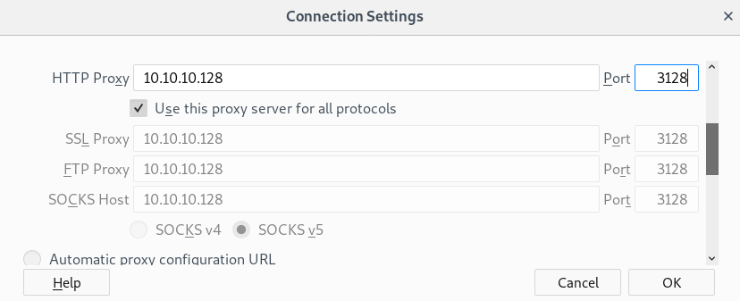
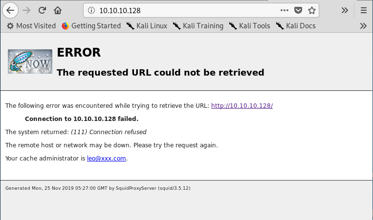
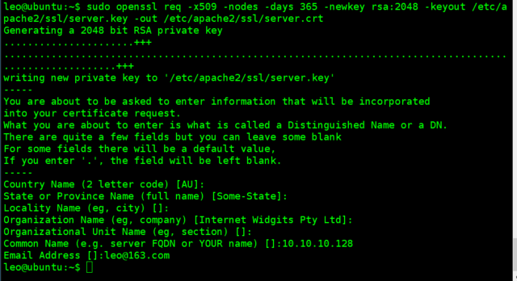

# 第12讲 Linux 安全工具2

本讲主要内容包括：
- Squid 代理服务器
- OpenSSL 服务器
- Tripwire
- Linux 安全发行版

## 使用 Squid 代理服务器

Squid是一款有多种配置及用途的web代理应用。该应用包含大量的访问控制方法，并支持不同的协议，如HTTP、HTTPS、FTP、SSL等。本节将介绍作为HTTP代理如何使用Squid。


### 安装

安装使用Squid，要求该系统物理内存足够大，因为Squid同时也是缓存代理服务器，需要空间来维护缓存。

本节将使用Ubuntu系统作为范例，在Ubuntu的软件池中提供了Squid，需要确保用户的系统是最新的。可以通过下述命令更新系统：```sudo apt update```

然后运行下列命令安装：```sudo apt install squid```


### 配置

Squid安装完成后，开始以缺省配置运行。缺省配置定义为阻塞网络上的所有HTTP/HTTPs流量。

要检验阻塞效果，需要在网络上任意一个系统中配置浏览器，指定代理服务器系统的IP地址作为代理。例如，当前ubuntu server的IP地址为 10.10.10.128，可以在你的另外一台带浏览器的虚拟机（例如kali 2019）中打开proxy设置，设置手动打开proxy。

IP地址 10.10.10.128，端口3128（squid默认端口）。例如：



> 注意，不要在自己的宿主机中做此设置。

而在Ubuntu server端，可以查看3128端口是否开启。


设置完成后，尝试在浏览器中打开任意网站，发现：


我们需要对squid进行简单配置：

1.设置Squid服务器的名称

任一编辑器中编辑```/etc/squid/squid.conf```文件。打开该文件后，查找标记：```Tag: visible_hostname```，在这个标记段的下方新的一行，输入下列内容：
```visible_hostname SquidProxyServer```。

SquidProxyServer这个名字是我们自定义的，当Squid代理拦截请求、发送错误报告时会显示这个名称。

2.设置允许访问代理服务器的IP段

在```/etc/squid/squid.conf```文件中查找标记```acl CONNECT method```，如果使用nano工具，可以按ctrl+w进行字符串查找。在这个标记的下面，添加文字：

```acl localnet src 10.10.10.0/24```

3.设置通知邮件地址

查找标记：```TAG: cache_mgr```，并在后面添加文字行：```cache_mgr email@yourdomainname```。可以用某个管理员的email ID替代email@yourdomainname作为联系方式，例如leo@xxx.com。

4.修改监听端口（可选）

http_port变量定义了Squid代理将监听的端口。默认端口是3128，可更改为任一未被使用的端口，还可以为Squid定义多个监听端口。

查找标记：```TAG: http_port```或```Squid normally listens to port 3128```，然后可以在注释的下方改写为：
```http_port 3128 3322 44333 7788```

5.设置允许访问规则

查找标记：```http_access allow localhost```，然后在下方添加：```http_access allow localnet```。

这条配置用于允许当前 SquidProxyServer 配置中的所有规则。acl用来定义规则，SquidProxyServer 是之前添加新规则的名字，src表示定义了代理服务器接收到的网络数据包中的源地址，这个地址可以是无分类IP地址段。

6.配置dns servers。在配置文件中找到```TAG: dns_nameservers```，然后在后门增加一行，输入内容```dns_nameservers 8.8.8.8 114.114.114.114 10.10.10.2```。

7.前面所有配置步骤完成后，使用下述命令重启Squid服务：```sudo systemctl restart squid.service```。

8.现在Squid代理服务器已运行，为了验证新配置的效果，在网络上任一系统的浏览器中访问代理服务器的IP地址：


上面页面中出现了squid的图标，表示它已经开始工作。访问其他域名，例如```www.baitu.com```，则会显示正常。

这样，我们就为内部网络增加了一个代理，所有向外发出的请求多了一级代理，我们可以在这个代理上设置更多的安全规则。可以参考：https://wiki.squid-cache.org/ConfigExamples#Online_Manuals


---

## OpenSSL服务器

SSL（安全套接层）是用于在网络上传输敏感信息的协议。这些信息包括账户密码、信用卡详细信息等。SSL常用于基于HTTP协议的web浏览器中 。


OpenSSL是用于传输层安全性（TLS）和安全套接字层（SSL）协议的功能齐全的商业级工具包，它也是一个通用密码工具库。

OpenSSL是根据Apache样式的许可证授权的，这意味着我们可以在某些简单的许可证条件下自由地将其用于商业和非商业目的。

下面，我们介绍如何使用OpenSSH实现计算机之间的远程控制和数据交换。你将了解到OpenSSH的一些配置以及如何在Ubuntu中修改这些配置。

传统的工具实现远程登录(telnet)和rcp等功能的方式不安全的，他们会用明文的方式交换用户密码。OpenSSH用后台进程和客户端工具来提高安全性，对远程控制和数据交换操作进行加密，比其他传统工具更加高效。

OpenSSH使用sshd持续地监听来自各个客户端程序的连接。当客户端发出连接请求，ssh根据客户端的连接类型来判断是否建立连接。比如，如果远程计算机是一个ssh客户端程序，OpenSSH将会在认证之后建立一个控制会话。如果远程用户使用scp进行连接，OpenSSH在认证之后会与客户端建立连接，并在后台初始化一个安全的文件拷贝。

OpenSSH可以使用密码、公钥和 Kerberos 等多种方式进行认证。

### 安装

我们需要两个虚拟机系统来演示OpenSSL的使用。一个系统作为服务器，安装OpenSSL及Apache，另一个作为客户机。

下面介绍如何使用OpenSSL为Apache创建自签名证书，该证书用于加密发送到服务器的网络流量。

1.使用下述命令在作为服务器的虚拟机系统上安装OpenSSL包:

```sudo apt install openssl```

2.使用下述命令在作为服务器的虚拟机系统上安装Apache Http Server：
```sudo apt install apache2```。


### 配置

1.Apache2安装完成后，作为Ubuntu系统中的Apache标配，需要启用SSL支持。通过运行下述命令启用：

```sudo a2enmod ssl```

2.使用下述命令重启Apache：```sudo systemctl restart apache2.service```。

3.使用下述命令在Apache的配置目录下创建一个目录用于存放证书文件。在后续步骤中将生成这些证书文件。```sudo mkdir /etc/apache2/ssl```

4.使用下图所示的命令创建密钥及证书：

```sudo openssl req -x509 -nodes -days 365 -newkey rsa:2048 -keyout /etc/apache2/ssl/server.key -out /etc/apache2/ssl/server.crt```

说明：
- -x509表示将遵循X.509证书签名请求（CSR）管理规范创建自签名证书。
- -nodes表示创建的密钥文件不需要密码保护。
- -days 365表示创建的证书有效期为1年。
- -newkeyrsa:2048表示将同时创建私钥文件及证书文件，密钥长度为2048比特。
- -keyout为创建的私钥名称。
- -out为创建的证书文件名称。

在创建密钥及证书文件过程中，会询问几个问题。需要用户根据配置情况提供详情。其中Common Name（如服务器FQDN或者用户名）选项很重要，需要提供域名或者服务器的公开IP地址，这里可以键入10.10.10.128.



5.编辑/etc/apache2/sites-available/default文件。
```sudo nano /etc/apache2/sites-available/default-ssl.conf```。

使用前面创建的密钥文件及证书文件来配置Apache。找到并编辑如下图所示的文字行。其中ServerName提供了Apache服务系统的IP地址及端口号。

找到或增加下列信息：
```
ServerAdmin webmaster@localhost
ServerName 10.10.10.128:443

SSLEngine on

SSLCertificateFile      /etc/ssl/certs/ssl-cert-snakeoil.pem
SSLCertificateKeyFile /etc/ssl/private/ssl-cert-snakeoil.key

```
> 注意：apache2的配置文件是apache2.conf，而不是apache中的http.conf。这个配置文件使用了很多includel包含其他配置文件。启动文件为enabled，是一些快捷方式。这些快捷方式可以在available文件中找到真正的配置文件。sites-avaibled中的000-default.conf是默认的配置文件，你可以在里面更改网站根目录。而sites-available/default-ssl.conf中是配置ssl的文件。

以上是openssl服务器中的配置。下面介绍客户端的情况。

在客户机系统上，打开浏览器并以 https://10.10.10.128 协议形式访问Apache服务器的IP地址，如下图所示：


>注意不是http://10.10.10.128 。而且这里容易出现错误，原因较复杂，与软件版本配合相关。

---

## tripwire 入侵检测系统

The tripwire可用于：
- 防止网络攻击
- 检测威胁隐患
- 识别系统脆弱性
- 实时加固配置


### 安装、配置

1.安装tripwire请允许下列命令：```sudo apt install tripwire```。

2.选择postfix配置。在弹出的对话框中选择Internet Site。


3.在询问system mail name（系统邮件名称），输入当前正在配置的Tripwire的系统域名或ip地址。

4.接受tripwire配置，即选择yes。生成口令（the site key），它被存放在/etc/tripwire/twcfg.txt中。

Tripwire 使用了一对密钥来对各种文件进行签名，由此来检查和防止它们被修改。键入的口令用于加强这个哈希过程不被破解。

5.在弹出的重新配置对话框“Rebuild tripwire configuration file”中，选择yes。

6.在弹出的“Rebuild tripwire policy file”对话框中选yes。

7.在弹出的“get site passphrase”对话框中输入一个口令，例如123456.

8.在弹出的“Tripwire has been installed”对话框中选择ok。

### 启动

1.安装及初始配置完成后，可以运行下列命令启动：
```sudo tripwire --init```

运行命令后将生成一个数据库。

2.在启动后的输出中，很多文件名后显示“No such file or directory”错误，这是因为Tripwire扫描了配置文件中设置的所有文件，不论系统中是否存在这些文件。

如果希望清除这些错误，需要编辑/etc/tripwire/tw.pol文件，该文件中有些文字行指向的文件/目录在当前系统中不存在，注释掉这些文字行；也可以对这些错误置之不理，因其并不影响Tripwire功能。

3.下一步测试Tripwire如何工作。通过运行下述命令创建新文件：

```touch tripwire_testing```

用户根据选择为新创建的文件命名。

4.运行Tripwire交互命令测试Tripwire是否正在检测，命令如下所示：
```tripwire --check –interactive```
 

5.如果需要记录屏幕中显示的变更信息，保存在编辑器中自动打开的检测结果文件即可。

保存检测结果文件时，会提示输入本地密码，需要用户输入安装Tripwire时设置的密码。

6.最后，在crontab添加一个条目以自动运行Tripwire来检测文件/目录的变更情况。在任一编辑器中打开/etc/crontab文件并添加下图中文字行：
```00 6   * * * /usr/sbin/tripwire --check```。

其中，006表示Tripwire将在每天6点进行检测。
