# 第12讲 Linux 安全检测工具 2

本讲主要内容包括：
- Squid 代理服务器
- OpenSSL 服务器
- Tripwire
- Linux 安全发行版

## 使用 Squid 代理服务器

Squid是一款有多种配置及用途的web代理应用。该应用包含大量的访问控制方法，并支持不同的协议，如HTTP、HTTPS、FTP、SSL等。本节将介绍作为HTTP代理如何使用Squid。


### 安装

安装使用Squid，要求该系统物理内存足够大，因为Squid同时也是缓存代理服务器，需要空间来维护缓存。

本节将使用Ubuntu系统作为范例，在Ubuntu的软件池中提供了Squid，需要确保用户的系统是最新的。可以通过下述命令更新系统：```sudo apt update```

然后运行下列命令安装：```sudo apt install squid```


### 配置

Squid安装完成后，开始以缺省配置运行。缺省配置定义为阻塞网络上的所有HTTP/HTTPs流量。

要检验阻塞效果，需要在网络上任意一个系统中配置浏览器，指定代理服务器系统的IP地址作为代理。例如，当前ubuntu server的IP地址为 10.10.10.128，可以在你的另外一台带浏览器的虚拟机（例如kali 2019）中打开proxy设置，设置手动打开proxy。

IP地址 10.10.10.128，端口3128（squid默认端口）。例如：


> 注意，不要在自己的宿主机中做此设置。

而在Ubuntu server端，可以查看3128端口是否开启。


设置完成后，尝试在浏览器中打开任意网站，发现：


我们需要对squid进行简单配置：

1.设置Squid服务器的名称

任一编辑器中编辑```/etc/squid/squid.conf```文件。打开该文件后，查找标记：```Tag: visible_hostname```，在这个标记段的下方新的一行，输入下列内容：
```visible_hostname SquidProxyServer```。

SquidProxyServer这个名字是我们自定义的，当Squid代理拦截请求、发送错误报告时会显示这个名称。

2.设置允许访问代理服务器的IP段

在```/etc/squid/squid.conf```文件中查找标记```acl CONNECT method```，如果使用nano工具，可以按ctrl+w进行字符串查找。在这个标记的下面，添加文字：

```acl localnet src 10.10.10.0/24```

3.设置通知邮件地址

查找标记：```TAG: cache_mgr```，并在后面添加文字行：```cache_mgr email@yourdomainname```。可以用某个管理员的email ID替代email@yourdomainname作为联系方式，例如leo@xxx.com。

4.修改监听端口（可选）

http_port变量定义了Squid代理将监听的端口。默认端口是3128，可更改为任一未被使用的端口，还可以为Squid定义多个监听端口。

查找标记：```TAG: http_port```或```Squid normally listens to port 3128```，然后可以在注释的下方改写为：
```http_port 3128 3322 44333 7788```

5.设置允许访问规则

查找标记：```http_access allow localhost```，然后在下方添加：```http_access allow localnet```。

这条配置用于允许当前 SquidProxyServer 配置中的所有规则。acl用来定义规则，SquidProxyServer 是之前添加新规则的名字，src表示定义了代理服务器接收到的网络数据包中的源地址，这个地址可以是无分类IP地址段。

6.配置dns servers。在配置文件中找到```TAG: dns_nameservers```，然后在后门增加一行，输入内容```dns_nameservers 8.8.8.8 114.114.114.114 10.10.10.2```。

7.前面所有配置步骤完成后，使用下述命令重启Squid服务：```sudo systemctl restart squid.service```。

8.现在Squid代理服务器已运行，为了验证新配置的效果，在网络上任一系统的浏览器中访问代理服务器的IP地址：


上面页面中出现了squid的图标，表示它已经开始工作。访问其他域名，例如```www.baitu.com```，则会显示正常。

这样，我们就为内部网络增加了一个代理，所有向外发出的请求多了一级代理，我们可以在这个代理上设置更多的安全规则。可以参考：https://wiki.squid-cache.org/ConfigExamples#Online_Manuals


---

## OpenSSL服务器

SSL（安全套接层）是用于在网络上传输敏感信息的协议。这些信息包括账户密码、信用卡详细信息等。SSL常用于基于HTTP协议的web浏览器中 。


OpenSSL是用于传输层安全性（TLS）和安全套接字层（SSL）协议的功能齐全的商业级工具包，它也是一个通用密码工具库。

OpenSSL是根据Apache样式的许可证授权的，这意味着我们可以在某些简单的许可证条件下自由地将其用于商业和非商业目的。

下面，我们介绍如何使用OpenSSH实现计算机之间的远程控制和数据交换。你将了解到OpenSSH的一些配置以及如何在Ubuntu中修改这些配置。

传统的工具实现远程登录(telnet)和rcp等功能的方式不安全的，他们会用明文的方式交换用户密码。OpenSSH用后台进程和客户端工具来提高安全性，对远程控制和数据交换操作进行加密，比其他传统工具更加高效。

OpenSSH使用sshd持续地监听来自各个客户端程序的连接。当客户端发出连接请求，ssh根据客户端的连接类型来判断是否建立连接。比如，如果远程计算机是一个ssh客户端程序，OpenSSH将会在认证之后建立一个控制会话。如果远程用户使用scp进行连接，OpenSSH在认证之后会与客户端建立连接，并在后台初始化一个安全的文件拷贝。

OpenSSH可以使用密码、公钥和 Kerberos 等多种方式进行认证。

### 安装

我们需要两个虚拟机系统来演示OpenSSL的使用。一个系统作为服务器，安装OpenSSL及Apache，另一个作为客户机。

下面介绍如何使用OpenSSL为Apache创建自签名证书，该证书用于加密发送到服务器的网络流量。

1.使用下述命令在作为服务器的虚拟机系统上安装OpenSSL包:

```sudo apt install openssl```

2.使用下述命令在作为服务器的虚拟机系统上安装Apache Http Server：
```sudo apt install apache2```。


3.测试

首先确定当前服务器的ip地址（以10.10.10.129为例），然后在其他虚拟机或宿主机的浏览器中输入url：http://10.10.10.129，可以看到如下界面：

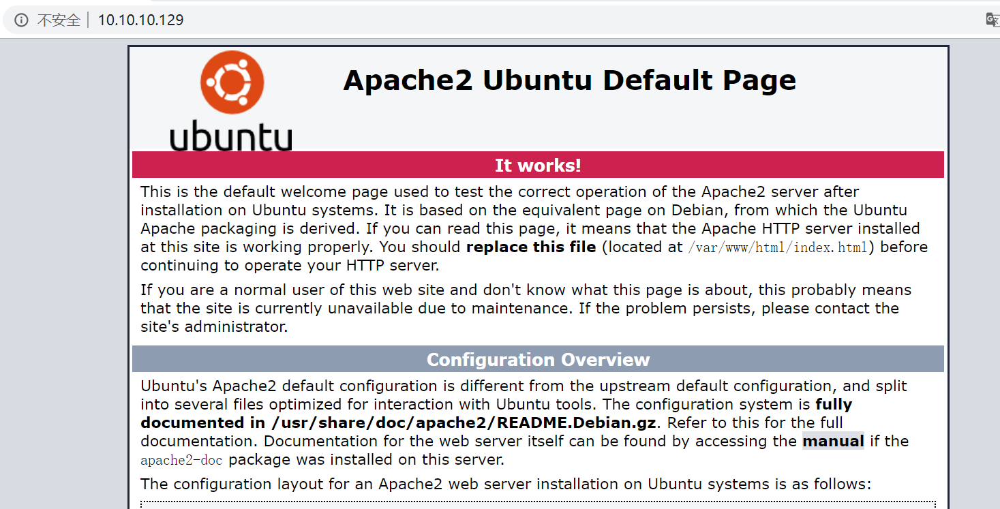

而输入 https://10.10.10.129，可以看到如下界面：

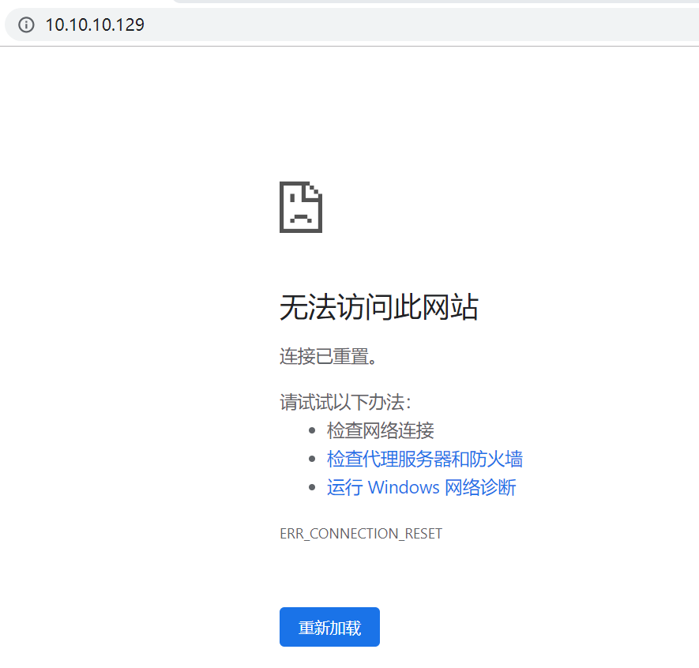


### 配置

1.Apache2安装完成后，作为Ubuntu系统中的Apache标配，需要启用SSL支持。通过运行下述命令启用：

```sudo a2enmod ssl```

2.使用下述命令重启Apache：```sudo systemctl restart apache2.service```。

执行完此操作后，可以再次使用某个客户端上的浏览器查看 https://10.10.10.129 。可以看到如下页面：

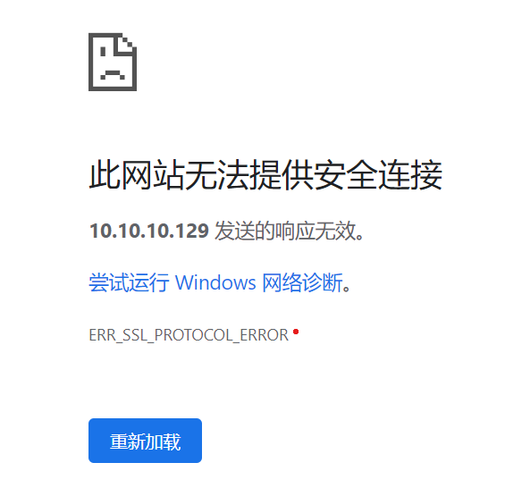

注意，与上一次响应的错误代码不同。本次显示的是“ERR_SSL_PROTOCOL_ERROR”。意味着SSL模块启动了，但未正确配置。

3.使用下述命令在Apache的配置目录下创建一个目录用于存放证书文件。在后续步骤中将生成这些证书文件。```sudo mkdir /etc/apache2/ssl```

4.使用下图所示的命令创建密钥及证书：

```openssl req -new -x509 -nodes -out /etc/apache2/ssl/server.crt -keyout /etc/apache2/ssl/server.key```

或

```sudo openssl req -x509 -nodes -days 365 -newkey rsa:2048 -keyout /etc/apache2/ssl/server.key -out /etc/apache2/ssl/server.crt```

说明：
- -x509表示将遵循X.509证书签名请求（CSR）管理规范创建自签名证书。
- -nodes表示创建的密钥文件不需要密码保护。
- -days 365表示创建的证书有效期为1年。
- -newkeyrsa:2048表示将同时创建私钥文件及证书文件，密钥长度为2048比特。
- -keyout为创建的私钥名称。
- -out为创建的证书文件名称。

在创建密钥及证书文件过程中，会询问几个问题。需要用户根据配置情况提供详情。其中Common Name（如服务器FQDN或者用户名）选项很重要，需要提供域名或者服务器的公开IP地址。


5.编辑/etc/apache2/sites-available/default文件。

```sudo nano /etc/apache2/sites-available/default-ssl.conf```。

使用前面创建的密钥文件及证书文件来配置Apache。找到并编辑如下图所示的文字行。其中ServerName提供了Apache服务系统的IP地址及端口号。

找到或增加下列信息：
```
ServerAdmin webmaster@localhost
ServerName 10.10.10.128:443

SSLEngine on

# SSLCertificateFile      /etc/ssl/certs/ssl-cert-snakeoil.pem
# SSLCertificateKeyFile /etc/ssl/private/ssl-cert-snakeoil.key
SSLCertificateFile     /etc/apache2/ssl/server.crt
SSLCertificateKeyFile  /etc/apache2/ssl/server.key

```

> 注意：apache2的配置文件是apache2.conf，而不是apache中的http.conf。这个配置文件使用了很多includel包含其他配置文件。启动文件为enabled，是一些快捷方式。这些快捷方式可以在available文件中找到真正的配置文件。sites-avaibled中的000-default.conf是默认的配置文件，你可以在里面更改网站根目录。而sites-available/default-ssl.conf中是配置ssl的文件。

以上是openssl服务器中的配置。下面介绍客户端的情况。

在客户机系统上，打开浏览器并以 https://服务器的IP地址 协议形式访问Apache服务器，如下图所示：

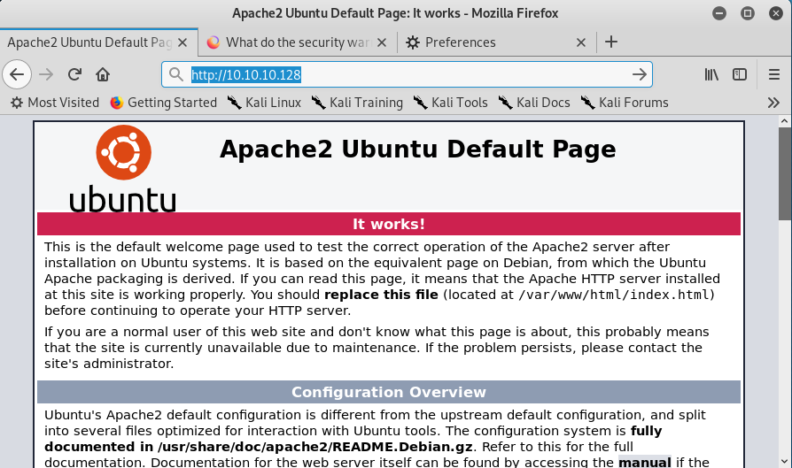

>注意：这里容易出现错误，原因较复杂，与软件版本配合相关。

---

## tripwire 入侵检测系统

The tripwire可用于：
- 防止网络攻击
- 检测威胁隐患
- 识别系统脆弱性
- 实时加固配置


### 安装、配置

1.安装tripwire请允许下列命令：```sudo apt install tripwire```。

2.选择postfix配置。在弹出的对话框中选择Internet Site。

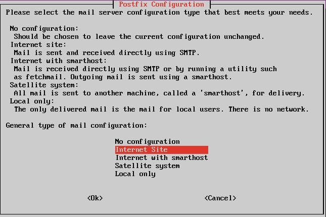

3.在询问system mail name（系统邮件名称），输入当前正在配置的Tripwire的系统域名或ip地址。

4.接受tripwire配置，即选择yes。生成口令（the site key），它被存放在/etc/tripwire/twcfg.txt中。

Tripwire 使用了一对密钥来对各种文件进行签名，由此来检查和防止它们被修改。键入的口令用于加强这个哈希过程不被破解。

5.在弹出的重新配置对话框“Rebuild tripwire configuration file”中，选择yes。

6.在弹出的“Rebuild tripwire policy file”对话框中选yes。

7.在弹出的“get site passphrase”对话框中输入一个口令，例如123456.

8.在弹出的“Tripwire has been installed”对话框中选择ok。

### 启动

1.安装及初始配置完成后，可以运行下列命令启动：
```sudo tripwire --init```

运行命令后将生成一个数据库。

2.在启动后的输出中，很多文件名后显示“No such file or directory”错误，这是因为Tripwire扫描了配置文件中设置的所有文件，不论系统中是否存在这些文件。

如果希望清除这些错误，需要编辑/etc/tripwire/tw.pol文件，该文件中有些文字行指向的文件/目录在当前系统中不存在，注释掉这些文字行；也可以对这些错误置之不理，因其并不影响Tripwire功能。

3.下一步测试Tripwire如何工作。通过运行下述命令创建新文件：

```touch tripwire_testing```

用户根据选择为新创建的文件命名。

4.运行Tripwire交互命令测试Tripwire是否正在检测，命令如下所示：
```tripwire --check –interactive```
 

5.如果需要记录屏幕中显示的变更信息，保存在编辑器中自动打开的检测结果文件即可。

保存检测结果文件时，会提示输入本地密码，需要用户输入安装Tripwire时设置的密码。

6.最后，在crontab添加一个条目以自动运行Tripwire来检测文件/目录的变更情况。在任一编辑器中打开/etc/crontab文件并添加下图中文字行：
```00 6   * * * /usr/sbin/tripwire --check```。

其中，006表示Tripwire将在每天6点进行检测。

## Linux 安全发行版

### 用于安全研究、渗透测试的 Linux 发行版

#### Kali Linux

Kali Linux是最广为人知的黑客渗透测试的 Linux发行版之一，Kali Linux基于Debian。它有许多工具，使你可以更轻松地测试、破解以及进行与数字取证相关的任何其他工作。如今Kali都是滚动升级，这意味其中的每个工具都将始终是最新的。

Kali Linux除了是最好的渗透测试平台之一，它还支持多种设备和硬件平台，此外，Kali Linux还提供了完整的文档和一个大型且活跃的社区。

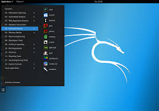

#### BackBox

BackBox是基于Ubuntu的Linux发行版,它是一款用于网络渗透测试及安全评估的操作系统，也是该领域最好的发行版之一。

BackBox拥有自己的软件库，提供各种系统和网络分析工具包的最新稳定版本，以及最著名的道德黑客工具，极简的设计风格，XFCE桌面环境（类 UNIX操作系统上的轻量级桌面环境），提供了快速、有效、可自定义等特性，背后的社区也十分强大

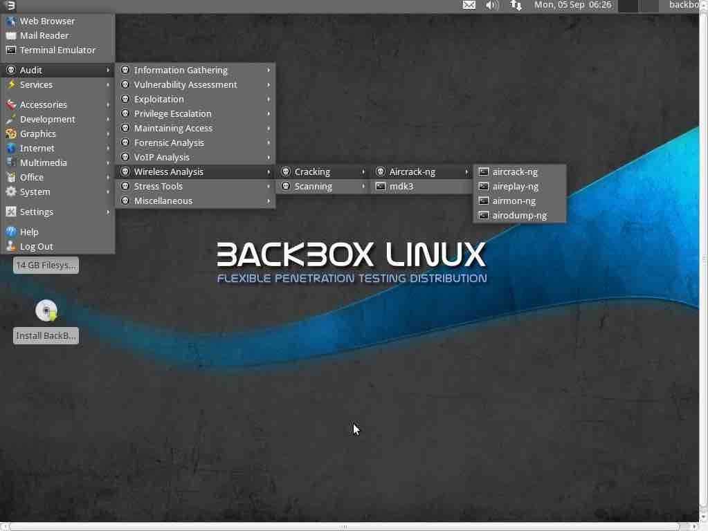

#### Parrot Security OS

Parrot Security OS 是面向安全的操作系统，它被设计为用于渗透测试、计算机取证、反向工程、攻击、云计算渗透测试、隐私/匿名、密码等场合。其用户群体主要为渗透测试人员。

Parrot Security OS基于 Debian，其特色在于 MATE 桌面环境，并由 Frozenbox network 开发。几乎所有公认的渗透测试工具都可以在这里找到，还有一些来自Frozenbox Network的独家定制工具。

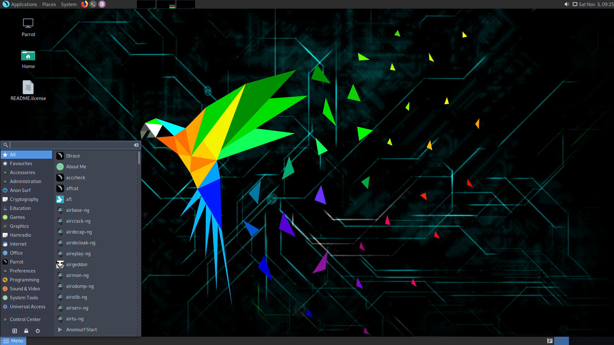

#### BlackArch

BlackArch是一个基于Arch Linux的渗透测试发行版，BlackArch有自己的存储库，其中包含许许多多的工具，而且数量一直增加。如果你已经是Arch Linux用户，可以直接在上面设置BlackArch tools集合。

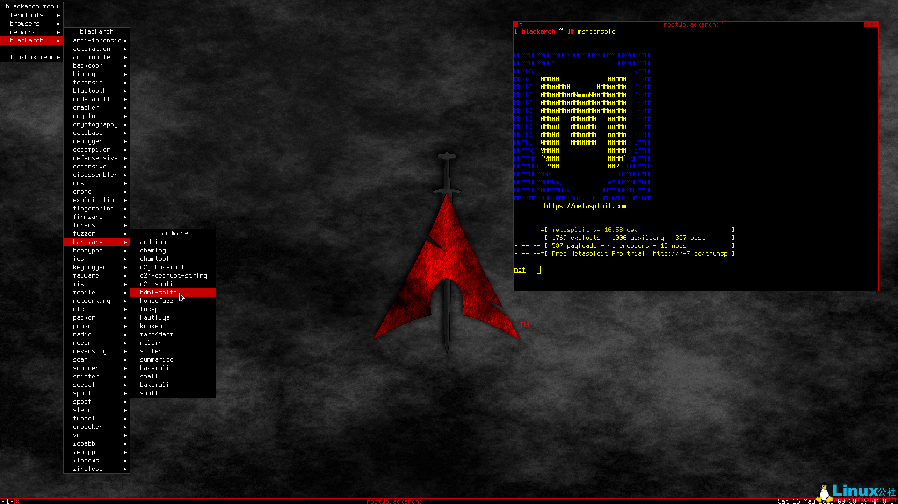

#### Bugtraq
Bugtraq是一个Linux发行版，Bugtraq支持Ubuntu、Debian和OpenSUSE的XFCE、GNOME和KDE桌面环境。它还有11种不同的语言版本。

Bugtraq包含了大量的渗透测试工具——移动取证、恶意软件测试，以及Bugtraq社区专门设计的工具。Bugtraq团队是一个非常有经验的极客和开发者组织。

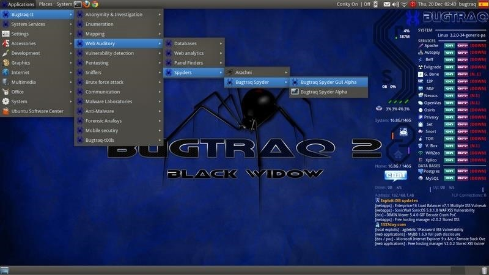

####  DEFT Linux
DEFT是Digital Evidence & Forensics Toolkit的缩写，是一份定制的Xubuntu自启动运行Linux光盘发行，包含了最佳的硬件检测，以及一些专用于应急响应和计算机取证的最好的开源应用软件。

DEFT可与DART (Digital Advanced Response Toolkit)配套使用，DART是一款适用于Windows的取证系统。它使用LXDE桌面环境和WINE运行Windows工具。

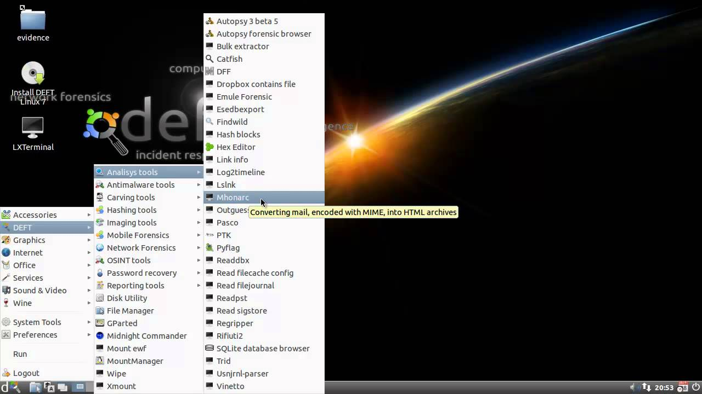

#### Samurai Web Testing Framework
Samurai Web Testing Framework致力于Web上的渗透测试，它是一个虚拟机，由Virtualbox & VMWare支持。

Samurai Web Testing Framework基于Ubuntu，包含最好的免费和开源工具，专注于测试和网站攻击，它还包括一个预先配置的Wiki，用于在渗透测试期间存储信息。

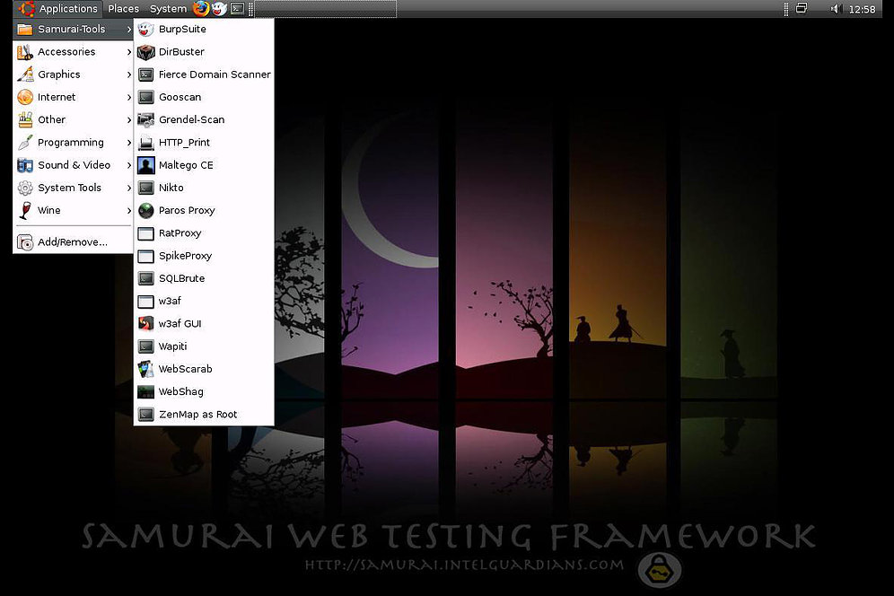

#### Pentoo Linux
Pentoo基于Gentoo Linux。它是一个专注于安全性和渗透测试的发行版，可以作为LiveCD使用，提供了32位和64为的live cd。


#### Caine
Caine是基于Ubuntu的GNU/Linux自启动运行发行，它作为安全研究部际中心(CRIS)的数字取证项目而创建，Caine具备各种为系统取证和分析而开发的各种工具。


#### Network Security Toolkit
Network Security Toolkit（NST）是一个基于Fedora的自启动ISO，它为安全专家和网络管理员提供了大量的开源网络安全工具。

NST提供了一个先进的Web用户界面，用于系统/网络管理、导航、自动化、网络监控和分析以及配置网络安全工具包发行版中的许多应用程序。

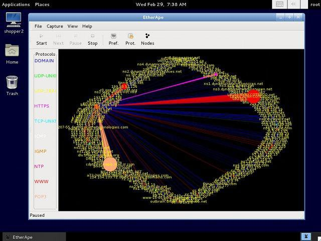

#### Fedora Security Spin
Fedora Security Spin是一个专为安全审计和测试而设计的发行版，也可用于教授安全方法。

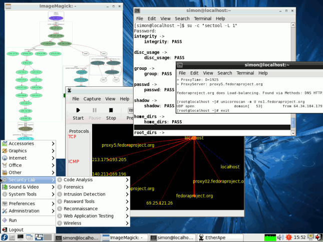

#### ArchStrike
ArchStrike（以前称为ArchAssault）是一个基于Arch Linux的项目，面向渗透测试人员和安全专业人员。它附带了Arch Linux的所有优点，以及用于渗透测试和网络安全的附加工具，所有这些工具和应用程序都属于模块化包组。


---

### 用于加固Linux安全的SELinux


安全增强式Linux（SELinux，Security-Enhanced Linux）是一个Linux内核的安全模块，其提供了访问控制安全策略机制，包括了美国国防部风格的强制访问控制（Mandatory Access Control，MAC）。

SELinux是一系列添加到多个Linux发行版的内核修改与用户空间工具。其软件架构力图从安全策略中分离出执行安全决策并优化涉及执行安全策略的软件。奠基SELinux的核心概念可以追溯回美国国家安全局（NSA）的一些早期项目。


美国国家安全局的安全增强式Linux团队称：
- 安全增强式Linux是一组给Linux核心的补丁。
- 提供一些更强、更安全的强制访问控制架构来和核心的主要子系统共同运作。
- 基于机密及完整性原则，它提供一个架构来强制信息的分离，以对付入侵的威胁或任何企图略过安全架构的应用程序。
- 借此限制恶意或设计不良的程序可能造成的破坏。
- 包含一组安全性原则配置配置文件的范本以符合一般的安全性目标。

Selinux访问控制机制基本过程：

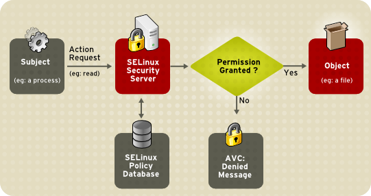


SELinux特性包含了：
- 执行最小特权原则，最大限度地减小系统中服务进程可访问的资源。
- 采用强制访问控制（MAC），所有活动都必须经预定策略机制授权。
- 没有“root”用户的概念，也没有传统Linux安全机制的缺点。（如依赖于setuid/setgid库）
- 在执行情况下将策略完全分离
- 定义充分的策略界面
- 支持问询策略并执行访问控制的应用程序（例如Cron在正确的上下文环境中运行工作）
- 独立于特定政策和策略语言
- 独立于特定安全标签格式与内容
- 对内核目标和服务的独立标记
- 支持策略更改
- 分离保护系统完整性（域名类）和数据保密（多层安全）的措施
- 灵活的策略
- 控制进程初始化与继承和程序执行
- 控制文件系统、目录、文件和开放性文件描述符
- 控制套接字、信息和网络界面
- 控制使用“容量”（Capabilities）
- 在访问决定中通过访问向量缓存（Access Vector Cache, AVC）预缓存信息

---

### 用于加密隐私保护的 Linux 发行版

####  Qubes

Qubes 是顶级的关注隐私的发行版之一。该发行版必须使用图形化安装程序将操作系统安装到硬盘驱动器，这是被加密的。

Qubes OS 使用 Xen Hypervisor 来运行多个虚拟机，其主要理念就是基于隔离的安全，它会将系统隔离为“个人”、“工作”和“上网”。这样，即便你不小心在工作机器上下载了恶意软件，但个人文件不会受到影响。

主桌面会使用颜色编码的窗口，用于展示不同的虚拟机，以方便区分。

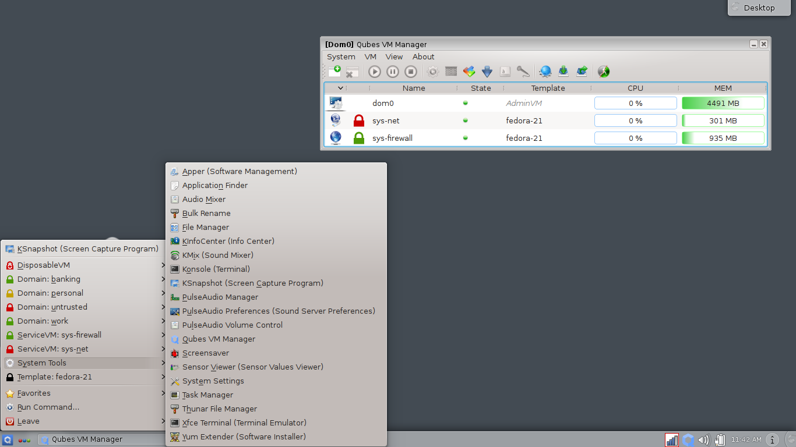

#### Tails

Tails (The Amnesiac Incognito Live System) 可能是最有名的关注隐私的 Linux 发行版之一，它是基于 Debian 的自启动光盘和 USB 发行。Tails 可以在 Live 模式下从 DVD 运行，从而将其完全加载进系统 RAM，并且其活动不会产生任何痕迹。这款系统也可以像普遍的系统一样在“持久”模式下运行，关于系统的设置会存储在加密的 U 盘上。

Tails 为用户提供了完整的因特网匿名功能，所有的网络流量都会经过匿名网络 Tor，它可隐藏你的上网痕迹，使得网络流量难以被追踪。Tails 中配备的应用程序也是经过谨慎选择的，以安全为理念进行了预配置，以增强用户的隐私安全。例如，KeePassX 密码管理器、网页浏览器、IRC客户端、邮件mail客户端等。值得注意的是 Tails 会不断发现漏洞，因此请务必经常检查更新。（当然对待任何操作系统都应如此）

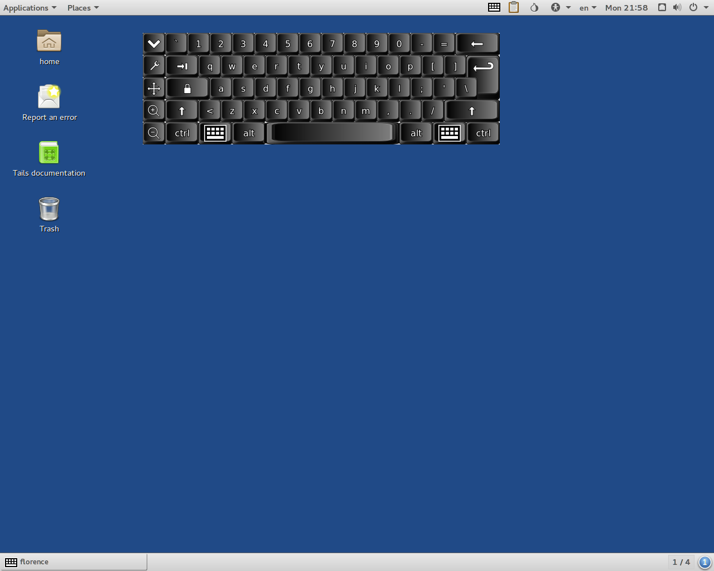

#### IprediaOS

IprediaOS 是一个基于 Linux 的快速、强大和稳定的操作系统，提供了匿名的环境。所有的网络流量都会被自动和透明地加密和匿名化。这个面向隐私的操作系统基于 Fedora Linux，可在 Live 模式下运行也可安装到硬盘上。正如 Tails OS 会将所有网络流量通过 Tor 网络以避免被追踪，Ipredia 中所有的网络流量都会经过匿名的 I2P 网络。

它的功能包括匿名电子邮件和 BitTorrent 客户端，IRC 聊天，以及浏览 eepsites（特殊的 .i2p 扩展名）的功能。与 Tor 不同的是，I2P 不能作为访问正常的互联网的网关，所以 Ipredia 无法安全地访问常规网站。不过只能访问 eepsites 的优点是你的连接是真正无法被追溯的。


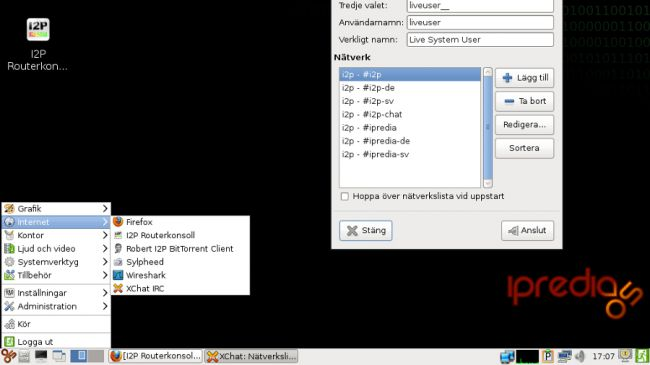

#### Whonix

引导一份 Live 操作系统是一个麻烦，因为必须重新启动计算机，但将其安装到硬盘意味着有被攻击的风险。Whonix 提供了一个优雅的方案，它被设计为运行在 Virtualbox 中作为一个虚拟机而工作。由于它在虚拟机中运行，所以 Whonix 与所有可运行 Virtualbox 的操作系统兼容。

Whonix 是一份聚焦于匿名性、隐私、安全的操作系统。它基于 Tor 匿名网络、Debian GNU/Linux、基于隔离的安全性。Whonix 包括两部分，一部分只运行在 Tor 上并扮演网关角色，这部分叫做 Whonix-Gateway；另一部分叫做 Whonix-Workstation，位于隔离网络中。只有经由 Tor 的连接被允许。有了 Whonix，你就可以匿名使用应用程序并在因特网上运行服务器。因匿名解析而造成的信息泄漏不可能存在，即便获得了根权限的恶意软件也无法发现用户的真实 IP 地址。

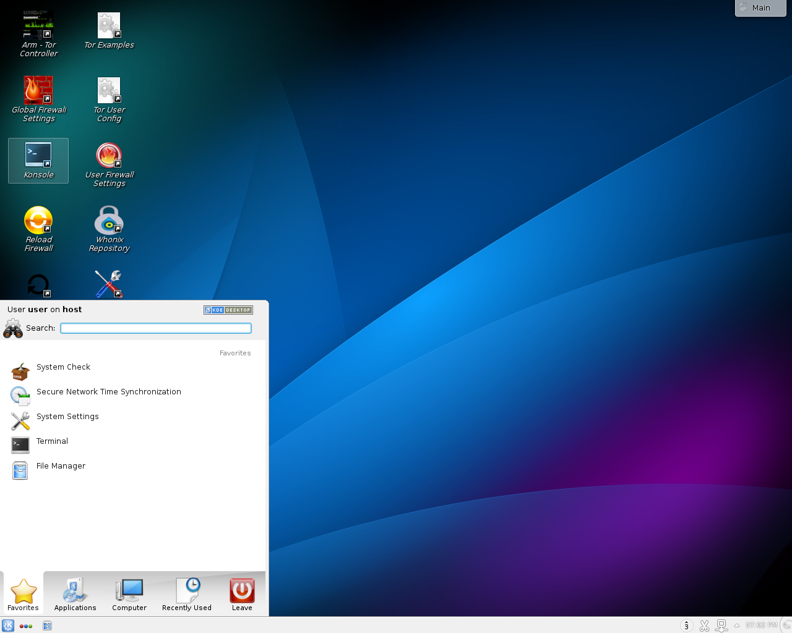

#### Discreete Linux

这个故意拼写错的发行版是优秀的 Ubuntu Privacy Remix 的继承者。该操作系统不支持网络硬件或内部硬盘驱动器，因此所有的数据都离线存储在 RAM 或 USB 设备中。它可以在 Live 模式下运行，但当从卷启动时也允许将一些设置存储在加密的‘Cryptobox’中。

还有另外一个值得关注的功能是它的内核模块只能在 Discreete Linux 团队进行数字签名后才能安装。这可以防止黑客试图偷偷安装恶意软件。请注意，该操作系统目前尚处于 Beat 测试阶段。


#### Subgraph OS

Subgraph OS 是基于 Debian 的 Linux 发行，为超强的安全性而设计，它提供了多种安全、匿名上网、加固的特性。它的内核通过许多安全性的增强进行了加固，Subgraph 还在诸如浏览器之类的高风险应用中创建了虚拟的“沙盒”。因此，任何针对独立应用程序的攻击都不会危及整个系统。

Subgraph OS 使用加固过的 Linux 内核及应用防火墙来阻止特定的可执行程序去访问网络，并强制要求所有的因特网流量都经由 Tor 网络。每个应用程序需要连接到网络和访问其他应用程序的“沙盒”都需经过手动的允许。

该发行的文件管理器带有特色工具可以从数据文件中移除元数据，并且还集成了 OnionShare 文件共享软件。该发行使用 Icedove 邮件客户端以自动配合 Enigmail 对电子邮件进行加密。

在 Subgraph 中，对文件系统的加密是强制性的，这意味着没有写入未加密数据的危险。要注意的是，Subgraph 还处于测试阶段，因此不要依赖使用它来保护任何真正敏感的数据（并且一如既往地保持常规的备份）。

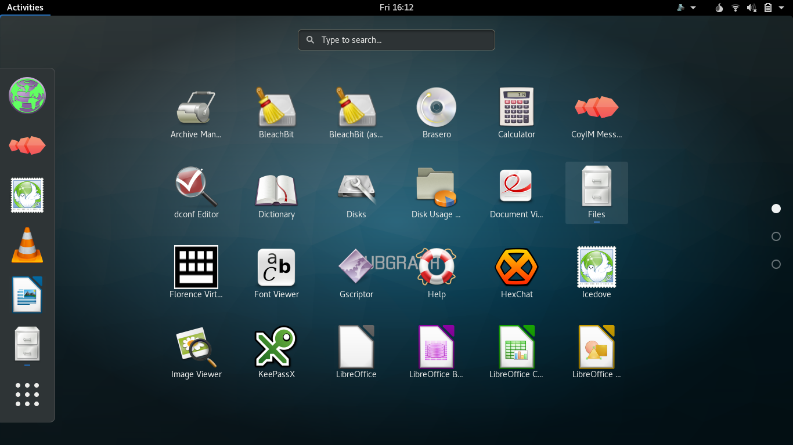

#### TENS

TENS(Trusted End Node Security)。以前被称为 LPS(Lightweight Portable Security)，这份 Linux 发行版是美国国防部的产品。Trusted End Node Security (TENS)是基于 Linux 的自启动运行光盘，其目标是让用户能在计算机上工作而不会有向恶意软件、键盘记录程序及其他因特网时代的恶疾泄露信息凭证及私人数据的风险。

它包含了最必需的一套应用软件及实用工具，例如 Firefox 网页浏览器，以及一份加密向导以对个人文件进行加解密。但有一个‘Public Deluxe’（公开豪华版）也包含了 Adobe Reader 和 LibreOffice 这样的工具。所有的版本都包含一个自定义防火墙，值得注意的是该操作系统支持通过 Smart Card 登录。

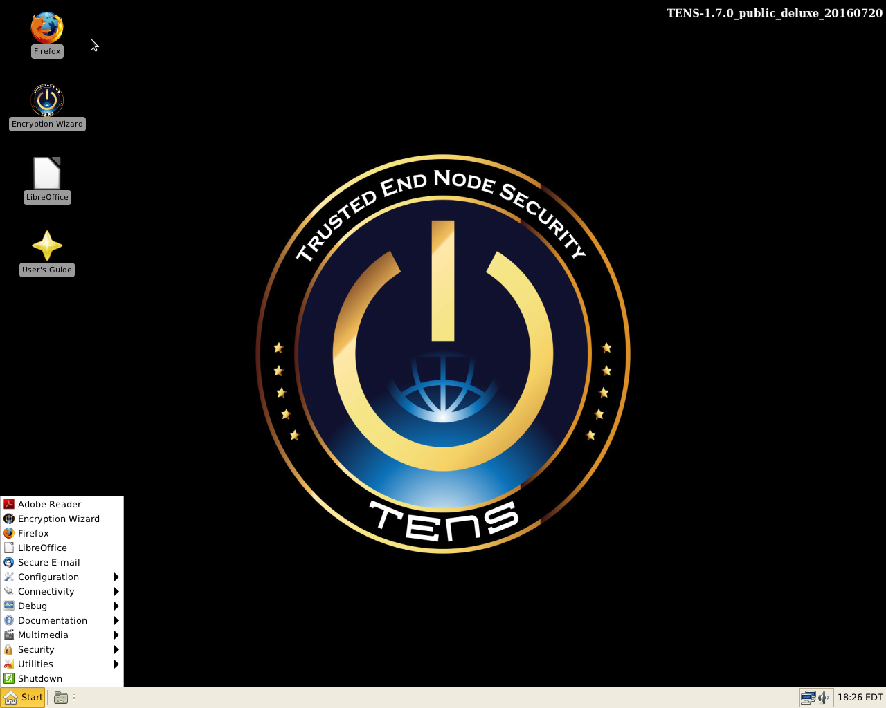