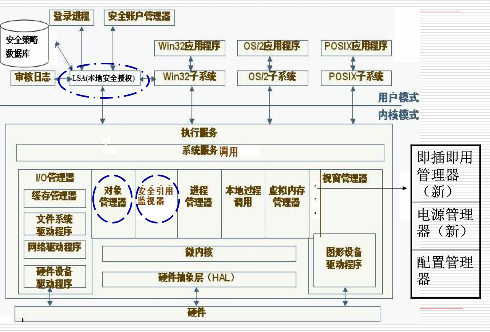
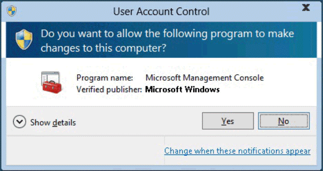
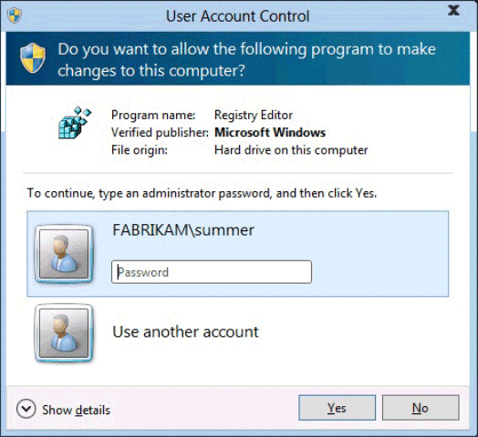
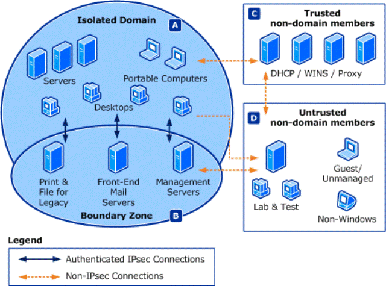

# Windows 安全

主要内容：

- 安全概述
- Windows的访问控制


## 安全概述

### Windows 安全体系

- 内核模式中的代码具有极高的特权，可以直接对硬件进行操作和直接访问所有的内存空间。
- 用户模式的代码拥有较低的特权，不能对硬件直接进行访问，内存访问受限。

windows安全体系图示:


---

### 本地安全授权 LSA

Windows中的 LSA 负责是所有本地和远程的用户登录生效，生成安全访问令牌访问令牌。

> 访问令牌是一个二进制的数据包，它描述了用户的访问权限以及用户所属地组。

---

管理员可以用```SECPOL.MSC```管理本地安全策略:


---

### 安全引用监控器SRM

LSA负责记录安全引用监视器的任何审核消息所产生的事件日志。

SRM和对象管理器联合起来。实施控制访问策略和审核策略。

SRM在对象句柄创建时进行安全性检查，而并不是在每次访问时进行检查。

---

### 对象管理器 Object Manager

OM,负责对象的命名，保护，分配和处理。

管理的对象包括：
- 目录，文件，设备，符号链接
- 进程 ，线程
- 网络共享资源
- 端口
- 窗口

> 每一个资源对象都与一个安全描述符相关联。

---

### 系统资源访问过程


---

## Windows的访问控制

Windows 中的访问控制, 是授权用户、组和计算机以访问网络或计算机上的对象的过程。 

### 安全标识符SID

安全标识符 (SID) 用于唯一标识安全主体或安全组。 SID是 Windows 安全模型的基础构建基块。 

安全主体可以表示可由操作系统进行身份验证的任何实体, 例如用户帐户、计算机帐户或在用户或计算机帐户的安全上下文中运行的线程或进程。

SID由 Windows 域控制器 或 本地 颁发，有唯一性，一旦发出则不可更改，它被存储在域安全数据库或本地SAM中。 

用户每次登录时, 系统都会为该用户创建访问令牌。 访问令牌包含：
- 用户的 SID
- 用户权限
- 用户所属的任何组的 Sid

#### 安全标识符的工作原理

SID的生成机制：

1.操作系统在创建帐户或组时生成标识特定帐户或组的 SID。 
2.本地帐户或组的 SID 由计算机上的本地安全机构 (LSA) 生成, 并与其他帐户信息一起存储在注册表安全区域中。 
3.域帐户或组的 SID 由域安全机构生成, 并以用户或组对象的属性的形式存储在 Active Directory 域服务中。
4.任何两个帐户或组都不共享相同的 SID。
5.每个用户和组的SID都是唯一的，永远不会有两个相同的SID。

用户令牌生成机制：

1.用户使用帐户名称引用帐户;
2.但操作系统内部使用账户的SID构建令牌；
3.每个SID令牌形成了一个权限上下文环境；
4.在某个域中，域的 SID 与帐户的相对标识符 (RID) 串联在一起, 创建安全主体的 SID。 
5.Sid 在其作用域 (域或本地) 内是唯一的, 它们永远不会重复使用。

#### 安全标识符体系结构

安全标识符是包含可变数目值的二进制格式的数据结构。 结构中的第一个值包含有关 SID 结构的信息。 剩余值按层次结构排列 (类似于电话号码), 并且它们标识 SID 颁发机构 (例如, "NT 机关")、SID 签发域以及特定安全主体或组。 下图说明了 SID 的结构。


下面为一个SID的例子
```S-R-X-Y1-Y2-Yn-1-Yn```
|符号|含义|
|-|-|
|S	|指示字符串为 SID|
|R|	指示修订级别|
|X|	指示标识符授权机构值|
|Y|	表示一系列的 subauthority 值, 其中n是值的个数|

SID 的最重要信息包含在 subauthority 值系列中。 序列的第一部分 (-Y1-Y2-Yn-1) 是域标识符。 此 SID 的此元素在具有多个域的企业中非常重要, 因为域标识符将由一个域颁发的 Sid 与企业中的所有其他域颁发的 Sid 区分开来。 企业中的任何两个域都不共享相同的域标识符。

Subauthority 值系列中的最后一个项 (-Yn) 是相对标识符。 它将一个帐户或组与域中的所有其他帐户和组区分开。 任何域中的两个帐户或组共享相同的相对标识符。

例如, 内置管理员组的 SID 以标准化的 SID 表示法表示, 如下字符串所示:```S-1-5-32-544```.

此 SID 具有四个组件:修订级别 (1)、标识符授权机构值 (5, NT 机构)、域标识符 (32, 内置)、相对标识符 (544、管理员)。

又例如：表示 Contoso域 (Contoso\Domain 管理员) 中的域管理员组的 SID:
```S-1-5-21-1004336348-1177238915-682003330-512```

Contoso\Domain 管理员的 SID 具有:
- 修订级别 (1)
- 标识符授权机构 (5, NT 机关)
- 域标识符 (21-1004336348-1177238915-682003330, Contoso)
- 相对标识符 (512, 域管理员)

#### 本节实验操作

1.尝试查看自己电脑windows系统当前用户的SID

方法如下：打开CMD,运行命令```whoami   /user``` ，然后将自己的SID的4个部分进行解析，可以参考 https://docs.microsoft.com/zh-cn/windows/security/identity-protection/access-control/security-identifiers。

2.尝试查看当前windows系统下所有用户的sid。

方法：在cmd中运行```wmic useraccount get name,sid```。

3.在注册表中查找各用户的SID.
方法：在CMD中运行“regedit”，点击确定进去注册表编辑器，点击HKEY_USERS。

以上问题，回答时将结果截图，连同分析结果以实验报告方式记录。

### 安全主体

安全主体是可以通过操作系统进行身份验证的任何实体。

例如用户帐户、计算机帐户或在用户或计算机帐户的安全上下文中运行的线程或进程, 或者这些帐户的安全组。 

每个安全主体在操作系统中由唯一的安全标识符 (SID) 表示。


#### 安全主体的工作原理

在 ActiveDirectory 域中创建的安全主体是 ActiveDirectory 对象, 可用于管理对域资源的访问。 


本地用户帐户和安全组在本地计算机上创建, 它们可用于管理对该计算机上的资源的访问权限。 

本地用户帐户和安全组由本地计算机上的安全帐户管理器 (SAM) 管理。

下图显示了 Windows authorization 和访问控制过程。 在此图中, 主题 (由用户发起的进程) 尝试访问某个对象, 例如共享文件夹。 将用户的访问令牌中的信息与对象的安全描述符中的访问控制项 (Ace) 进行比较, 并做出访问决定。 安全主体的 Sid 在用户的访问令牌和对象的安全描述符中的 Ace 中使用。


### Windows 用户和组

#### 本地用户账户

本地用户帐户存储在服务器本地。 这些帐户可以分配给特定服务器上的权利和权限, 但只能在该服务器上分配。 

本地用户账户有以下几种：
- 默认本地账户
- 标准本地账户

默认本地用户帐户是内置帐户, 这些帐户是在安装 Windows 时自动创建的。有以下几类：

##### 管理员账户

管理员账户，SID S-1-5-域-500，是在 Windows 安装期间创建的第一个帐户。

管理员帐户拥有本地计算机上的文件、目录、服务和其他资源的完全控制权限。 管理员帐户可以创建其他本地用户、分配用户权限和分配权限。 管理员帐户只需通过更改用户权利和权限即可随时控制本地资源。

默认管理员帐户不能删除或锁定, 但可以重命名或禁用。

###### 安全注意事项

- 最好禁用管理员帐户, 以使恶意用户更难获得访问权限。
- 可以重命名管理员帐户。 但重命名的管理员帐户将继续使用同一个自动分配的安全标识符 (SID), 这些标识符可以由恶意用户发现。 
- 作为安全最佳做法, 请使用本地 (非管理员) 帐户登录, 然后使用 "以管理员身份运行" 来完成更高的权限级别的任务。 
- 不要使用管理员帐户登录到重要的计算机。
- 在 Windows 客户端操作系统上, 当多个用户作为本地管理员运行时, IT 人员无法控制这些用户或其客户端计算机。在这种情况下, 需要使用组策略来启用一些安全设置，自动控制本地管理员组权限。

##### 来宾账户

默认情况下, 来宾帐户在安装时处于禁用状态。 

来宾帐户允许偶尔或一次性用户 (这些用户在计算机上没有帐户) 使用受限的用户权限暂时登录到本地服务器或客户端计算机。 

默认情况下, 来宾帐户具有空白密码。 

由于来宾帐户可以提供匿名访问, 因此存在安全风险。 

出于此原因, 将来宾帐户保留为禁用状态是最佳做法。

启用来宾帐户后, 最佳做法是经常监视来宾帐户, 以确保其他用户无法使用服务和其他资源

##### HelpAssistant 账户

HelpAssistant 帐户是在运行远程协助会话时启用的默认本地帐户。 如果没有等待远程协助请求, 此帐户将自动禁用。

对于 "请求的远程协助", 用户通过电子邮件或文件向可提供帮助的人员发送来自其计算机 (通过电子邮件或文件) 的邀请。 接受用户的远程协助会话邀请后, 系统会自动创建默认的 HelpAssistant 帐户, 以使提供帮助的人员对计算机的访问权限有限。 HelpAssistant 帐户由远程桌面帮助会话管理器服务管理。

##### DefaultAccount
DefaultAccount (也称为默认系统托管帐户 (DSMA)) 是 Windows 10 版本1607和 Windows Server 2016 中引入的内置帐户。 DSMA 是众所周知的用户帐户类型。 它是一种用户中立的帐户, 可用于运行多用户感知或用户不可知的进程。 默认情况下, 在桌面 Sku (完整 windows Sku) 上禁用 DSMA, 并在桌面上禁用 WS 2016。

DSMA 具有已知的 503 RID。 因此, DSMA 的安全标识符 (SID) 将具有以下格式的已知 SID: S-1-5-21-\ -503.

从权限角度来看, DefaultAccount 是标准用户帐户。 DefaultAccount 是运行多用户相关应用 (MUMA 应用) 所必需的。 MUMA 应用始终运行, 并对登录设备和注销设备的用户做出响应。 

管理默认帐户 (DSMA) 的建议:  
Microsoft 不建议更改默认配置, 即帐户处于禁用状态。 让帐户处于禁用状态不会产生安全风险。 

##### 标准本地用户

由管理员用户生成的、不具备管理员权限的用户。


当标准用户的操作，需要用户的管理访问令牌时，windows会弹出下列提示：


管理员还可以设置UAC或本地组控制策略，要求在执行管理操作时提示输入管理员口令。



提升提示的颜色编码如下所示:

- 红色背景, 红色盾牌图标: 应用被组策略阻止或来自被阻止的发布者。
- 蓝色背景, 带有蓝色和金色盾牌图标: 应用程序是 Windows10 管理应用程序, 如 "控制面板" 项目。
- 蓝色背景, 带有蓝色盾牌图标: 应用程序使用 Authenticode 签名, 并且受本地计算机信任。
- 黄色背景, 黄色盾牌图标: 应用程序未经签名或已签名, 但尚未被本地计算机信任。


#### 本地账户的管理

管理本地账户的目的有2个：
- 在本地服务器上分配权利和权限
- 在本地服务器上限制本地用户和组执行特定操作的能力。

为了防止盗用管理员或合法用户凭据，通常的做法有：
- 尽量使用标准用户帐户登录到您的计算机, 而不是使用管理员帐户执行任务；
- 对远程访问强制执行本地帐户限制。
- 拒绝所有本地管理员帐户的网络登录。
- 为具有管理权限的本地帐户创建唯一密码。

---

#### 实验操作

一.强制实施对远程访问的本地账户限制

1.启动组策略管理控制台（运行命令```gpedit.msc```)；
2.在控制台树中，打开“计算机配置”——"Windows设置"——“安全设置”；
3.继续打开“本地策略”——“用户权限分配”


4.查看当前有哪些用户被禁止从网络访问本台计算机。将结果截图记录于实验报告中。

> windows建议：拒绝所有本地管理员帐户的网络登录。

二.更改账户策略

1.启动组策略管理控制台（运行命令```gpedit.msc```)。
2.在控制台树中，打开“计算机配置”——"Windows设置"——“安全设置”。
3.继续打开“本地策略”——“账户锁定策略”
4.修改其中“账户锁定阈值”为5次。
5.更改系统建议的“账户锁定时间”为30分钟。
6.更改“充值账户锁定计数器”为30分钟后。
7.修改“密码策略”中的密码长度最小值为8个字符。
8.修改“密码最长使用期限”为30天。
9.开启“密码必须符合复杂性要求”。

以上操作执行后截图存于实验报告中。

---

#### 用户组账户

- 具有相似工作或资源要求的用户可组成一个用户组。
- 对资源的存取权限许可分配给一用户组，就是同时分配给该组中的所有成员。

#### 内置用户账号

- Aministrator 最高级别的账号，应重命名该账号并设置密码以隐藏它，以免受到攻击。
- Guest 保持Guest账号的禁用状态。

---

#### 内置用户组账号

可以在windows nt下输入```lusrmgr.msc```命令查看用户组和用户设置.

- Administrator：管理员组
- USERS：普通用户组
- Gusts：来宾用户组
- Backup Operatoes：备份操作组，做系统的备份操作
- Replicator:复制操作组
- *Operators (Print，Accout, Server)
- Domain：只在域服务器上的组
- 特殊组(Network,Intrative….)

---

#### 实验操作

查看自己的Windows系统用户和组，回答以下问题：
1.本地用户有几个，分别是何种权限？

2.本地用户组有几个，分别用于何种角色？

3.Windows server提供了不少用户组，你对这些用户组的使用意见是？

以上题目的答案请以实验报告形式提交到高校邦。

---

### 工作组，域和信任关系

#### 工作组

工作组（WorkGroup）为小型办公系统提供了资源共享功能，使用户可共享其他计算机上的本地资源。

不共享任何用户账户信息和组账户信息，每个系统使用独立的SAM数据库独立验证。

适用于小型环境，不进行集中控制，用户数量增多时，难以管理。

---

#### Domain

域是一个计算机集合，包含“
- 一或多个集中安全授权机构（AAA服务器）
- 若干台工作站（PC)
- 若干服务器(Web、文件、数据库)

域的特点：
- 域为用户，组合计算机账户定义了管理边界范围；
- 一个域中的所有用户共享域用户账户数据库和普通的安全策略。
- 每台计算机不需要提供自己的验证服务。
- 一旦用户用域验证服务通过验证，就可以在域内访问权限内资源。

---

#### 信任关系

信任关系是域之间的关系。

当域之间建立信任关系后，一个域就可以信任另一个域中的用户访问自己的资源，而又不必在本域拥有这个用户的账户和口令。

信任关系的好处：
- 实现跨域的集中安全验证
- 支持用户的单一登录

信任关系的种类:
- 单向信任
- 双向信任

NT的信任关系是单向且不具有传递性，windows server 2000之后默认信任关系是双向且可传递。



---

### 域和工作组的对比

- 域可定义安全管理边界，工作组无集中管理，相互独立。
- 域中所有用户共享普通的用户账户数据库和安全策略。
- 域在验证用户身份时，使用安全账户数据库；
- 域验证时，每台计算机不需要提供自己的验证服务；
- 域在整个受信任域中访问许可的资源。

- 工作组中计算机使用本地账户和本地策略。
- 工作组中计算机上的用户登录本机时，验证需要使用账户SAM文件；而当登录到域时用的是域上的用户账户数据库。
- 工作组中登录验证用的是本机的验证服务；
- 工作组为本机资源。

---

### 动态访问控制

微软公司在 Windows Server 2012 和 Windows 8 之后的windows中引入了动态访问控制及其关联的元素。目的是由“中央”集中、灵活的管控某个域的访问控制。

动态访问控制可用于：
- 通过使用自动和手动文件分类来识别数据。
- 使用"中央访问策略"的网络安全策略来控制对文件的访问。 
- 通过对合规性报告和取证分析使用中央审核策略，审核对文件的访问。 
- 通过对敏感的 Microsoft Office 文档使用自动 RMS 加密，来应用 Rights Management Services (RMS) 保护。


### 用户访问控制

#### UAC 体系结构

下图详细介绍了 UAC 体系结构。


## 活动目录（Active Directory）

### AD概念（是什么？）

目录是将对象的信息存储在网络的层次结构。 

目录服务，如 Active Directory 域服务 (AD DS) 提供了存储目录数据，并使网络用户和管理员能方便使用的方法。

 Active Directory 将对象的信息存储在网络上，通常，这些对象包括共享的资源，如服务器、 卷、 打印机和网络用户和计算机帐户。


**AD是一个以层次结构存储网络资源信息的目录（数据库）。通过它，组织机构（或者说管理员、又或者说是Windows域控制器）可以有效地对分布式网络对象进行共享和管理。它扮演着中心授权机构的角色。**

Windows Server Active Directory 域服务：
目的是提供一套完整的用户身份验证系统，实现用户在windows域中的单点登录，同时实现对共享资源和服务的管理及访问。

### 功能机制

活动目录提供了一个完全集成于windows的、安全的、分布式的、可扩展的、可重复的、分层目录服务。

Active Directory 包括：
- 一个层次化网络资源信息库，包含每个对象的信息；
- 一组规则架构，定义了如何描述对象和访问对象的格式；
- 一个查询和索引机制，以便可以发布和发现的网络用户或应用程序对象和其属性。 
- 一个复制服务。

简单而言，利用AD能够实现：
- 单点登录
- 全局目录
- 智能信息复制
- 一致的组策略


