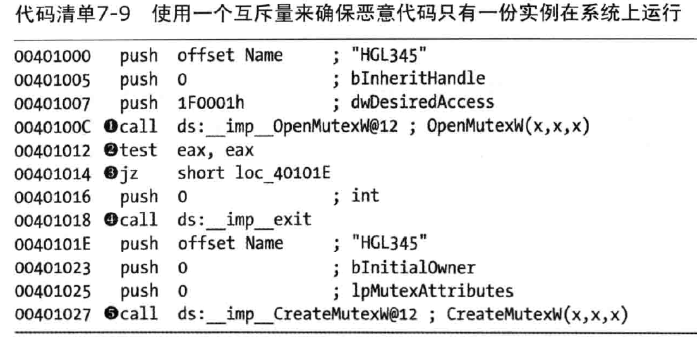

# 分析恶意Windows程序

非恶意程序总体上由编译器良好生成；恶意程序通常结构很差，并趋向于执行预期之外的动作。

## Windows API

Windows API是一个广泛的功能集合，管理着恶意代码与微软程序库之间的交互方式。

它使用特定的术语、名字、约定，需要我们熟悉。

### 类型和匈牙利表达法

多数Windows API使用它自己的名字，来表示C语言类型。举例说明：

- DWORD，表示32位无符号整数；
- WORD，表示16位无符号整数；

Windows总体上使用匈牙利表达法，作为API函数标识符。这个表达式使用一个前缀命名模式，来使识别一个变量的类型更为容易。包含一个32位无符号整数的变量，或DWDRD，会以dw开头。举例来说，如果VirtualAllocEx函数的第三个参数是dwSize，你就知道它是一个DWORD类型。

匈牙利表达法使识别变量类型和解析代码更容易，但它也能变得笨重。


### 句柄

句柄是在操作系统中被打开或被创建的项，比如一个窗口、进程、模块、菜单、文件，等等。

句柄在它们引用一个对象或其他某个内存位置这点上很像指针。然而，和指针不同的是，句柄不能被用来进行数学操作，并且它们不总是表示对象地址。你能对句柄做的唯一的事情，就是保存它，并在后续函数调用中使用它来引用同一个对象。

### 文件系统函数

恶意代码与系统交互的一个最常用的方式就是创建或修改文件，而且独特文件名或修改为既有的文件名是明显的基于主机的感染迹象。

文件活动可以提示这个恶意代码在做什么。例如，若恶意代码创建一个文件，并在那个文件中保存Web浏览习惯，这个程序可能就是某种形式的间谍软件。

微软提供了多个函数来访问文件系统：

- CreateFile

这个函数被用来创建和打开文件。它可以打开已经存在的文件，管道，流，以及I/O设备，还能创建新的文件。参数dwCreationDisposition控制CreateFile函数是否创建一个新的文件，或是打开一个己经存在的文件。

- Readfile
- WriteFile

上面两个函数被用来对文件进行读和写。两个都将文件作为流来操作。当你第一次调用ReadFile时，你从一个文件中读取后续一些字节;下次你调用它，你读取它后面的一些字节。例如，若你打开一个文件，并用40字节大小调用ReadFile，下次你再调用它，它将会从前40个字节之后处开始读。如
你所能想象的，这两个函数都不能在一个文件中灵活地跳转。

- CreateFileMapping
- MapViewOfFile

文件映射经常被恶意代码作者使用，因为它们允许将一个文件加载到内存中，以便更加容易地进行操作。

CreateFileMapping函数负责从磁盘上加载一个文件到内存中。

MapViewOfFile函数则返回一个指向映射的基地址指针，它可以被用来访问内存中的文件。

程序调用两个函数，能够使用从MapViewOfFile函数返回的指针，在文件中的任意位置进行读取和写入。

这个特性在解析一个文件格式时极其顺手，因为你可以简单地跳转到不同内存地址。

注意:文件映射被普遍用来复制Windows加载器的功能。在获得一个文件的映射以后，恶意代码可以解析PE头，并对内存中的文件进行所有需要的修改，因此使PE文件就像被操作系
统加载器加载一样执行起来。

### 特殊文件

Windows系统中有一些特殊的文件类型，它们的访问方式与普通文件不太一样，但是它们不能通过它们的盘符与文件夹(比如c:\dots)进行访问。恶意程序经常使用特殊文件。

有些特殊文件要比普通文件更隐蔽，因为它们在列目录时不会显示出来。某些特殊文件可以提供对系统硬件和内部数据更强的访问能力。

特殊文件可以作为字符串参数被传递给任何文件操作函数中，并像普通文件一样进行操作。在这里，我们来介绍一下共享文件、可通过名字空间访问的文件和备用数据流。

#### 共享文件

共享文件是以```\\serverNamel\share或\\?\serverName\share```开头命名的特殊文件。它们用来访问保存在共享目录中的目录或文件。```\\ ? \```前缀告诉操作系统禁用所有的字符串解析，并允许访问长文件名。

#### 通过名字空间访问的文件
    
在操作系统中，还有一些文件可以通过名字空间进行访问。名字空间可以被认为是固定数目的文件夹，每一个文件夹中保存不同类型的对象。底层的名字空间是NT名字空间，以前缀\开始。

NT名字空间可以访问所有设备，以及所有在NT名字空间中存在的其他名字空间。


注意:要浏览你系统上的NT名字空间，可以使用从微软那里免费获得的WinObj对象管理器名字空间查看器。

以前缀```\\.\```开始的Win32设备名字空间，经常被恶意代码用来直接访问物理设备，并且像一个文件一样进行读写操作。

例如，一个程序可能使用```\\.\PhysicalDisk1```来直接访问PhysicalDisk1，而忽略它的文件系统，因此这允许程序通过普通API不可能做到的方式来修改磁盘。使用这个方法，恶意代码可以读写数据到一个未分配的扇区，而无须创建或访问文件，这允许它避开防病毒与安全程序的检测。

例如，几年前的Witty蠕虫通过NT命名空间访问```\Device\PhysicalDiskl```，使受害者的文件系统崩溃。它可以打开```\Device\PhysicalDiskl```，并间歇性地写数据到驱动器上的随机空间中，最终使受害者的操
作系统崩溃并无法引导。这个蠕虫持续时间不长，因为受害者的系统在这个蠕虫能够传播之前就经常发生故障了，但它对被它感染的系统造成了不小的损失。

另一个例子是恶意代码使用```\Device\PhysicalMemory```来直接访问物理内存，这允许用户空间程序写到内核空间中。这个技术己经被恶意代码用来修改内核，并隐藏用户空间的程序。

注意:从Windows 2003 SP1开始，```\Device\PhysicalMemory```从用户空间已经无法访问。然而，你仍然可以从内核空间访问到 ```\Device\PhysicalMemory```，这可以被用来访问诸如BIOS代码和配置的底层信息。


#### 备用数据流
    
备用数据流(ADS)特性允许附加数据被添加到一个己存在的NTFS文件中，相当于添加一个文件到另外一文件中。

额外数据在列一个目录时不会被显示出来，并且当显示文件内容时也不显示; 而只有在你访问流时，它才是可见的。

ADS数据流根据约定```normalFile.txt: Stream: $DATA```来命名，这允许一个程序去读写一个流。恶意代码作者喜欢ADS，因为它能被用来隐藏数据。

## Windows 注册表

Windows注册表被用来保存操作系统与程序的配置信息，比如设置和选项。

与文件系统一样，它是基于主机的感染迹象的很好来源，并且能够揭示出关于恶意代码功能的有用信息。

Windows早期用.ini文件存放配置信息。注册表被引入后，几乎所有的Windows配置信息都被保存到注册表中，包括网络驱动、启动项、用户账户、以及其它信息。

恶意代码经常使用注册表来完成持久驻留或者存储配置数据。

注册表十分庞大，以至于恶意代码有多种方法使自己驻留。

### 注册表术语

- 根键，注册表一般被划分为5个顶层节。有时，HKEY和储槽也是指根键。每个根键都有自定含义。
- 子健，根键下的子“文件夹”
- 键，一个键是注册表中的文件夹。它可以包含额外的文件夹或键值。根键、子健也是键。
- 值项，即一个配对的名字和值。
- 值或数据，值或数据是存储在注册表项中的数据。

### 根键

注册表里有5个根键：

- HKEY_LOCAL_MACHINE（HKLM)，保存对本地机器的全局设置。
- HKEY_CURRENT_USER(HKCU)，保存当前用户特定的设置。
- HKEY_CLASSES_ROOT，保存定义的类型信息。
- HKEY_CURRENT_CONFIG，保存关于当前硬件配置的设置，特别是与当前和标准配置之间不同的部分。
- HKEY_USERS，定义默认用户、新用户和当前用户的配置。

最常用的是HKLM和HKCU。

一些键实际是虚拟键值，提供一种引用底层注册表信息的方式。例如，HKEY_CURRENT_USER键实际上存储在HKEY_USERS\SID中，这里SID是当前登录用户的安全描述符。

例如，一个常用的子键，HKEY_LOCAL_MACHINE\SOFTWARE\Microsoft\Windows\CurrentVersion\Run，包含一系列值，这些值列举了当一个用户登录时被自动启动的可执行程序。根键是HKEY_LOCAL_MACHINE，它保存了SOFTWARE、Microsoft、Windows、CurrentVersion以及Run子键。

### Regedit

这个工具可以编辑注册表。

### 自启动程序

向Run子键中写入想，是一个设置程序自启动的方法。虽然不是一个隐蔽技术，但也被恶意程序常用。

Autoruns工具可以列举OS 启动时自动运行的代码。它会查找注册表中的25~30个位置，来找到被设计为自动运行的代码。


### 常用注册表函数

恶意代码经常使用作为Windows API一部分的注册表函数，来修改注册表，以使它们自身能够在系统引导时自动启动运行。

下面是最常用的注册表函数：

- RegOpenKeyEx，打开一个注册表进行编辑和查询。
- RegSetValueEx，添加一个新值到注册表，并设置它的数值。
- RegGetValue，返回注册表中一个值项的数值。

当在恶意代码中看到这些函数时，你应该标识出他们访问的注册表键值。


上面程序的注释信息提供了关于这些被压栈参数值的有意义信息。

- samDesired值只是了安全访问请求的类型；
- ulOptions域是一个表示这个调用选项的无符号长整数，
- hKey则是被访问根键的句柄。

这段代码在（1）处调用了RegOpenKeyEx函数，而它的参数需要打开一个到注册表键HKLM\SOFTWARE\Microsoft\Windows\CurrentVersion\Run的句柄。在（5）处的名字和在（4）处的数据，被作为这个函数的参数保存在栈上。在（2）处对lstrlenW的调用是需要的，可以获取到数据的大小，它在（3）处作为对RegSetValueEx函数的一个参数来提供。


### 使用.reg文件的注册表脚本

用.reg作为扩展的文件包含一个人类可读的注册表数据。当一个用户双击一个.reg文件时，他会自动通过合并文件包含的信息到注册表中，来修改注册表——几乎像一个修改注册表的脚本一样。


## 网络API

恶意代码经常要使用网络，Windows API中就有许多可以进行网络通信的函数。

创建网络特征的任务是复杂的，以后专题讨论。

现在，我们主要关注识别和理解常见的网络函数，这样可辨别出一个恶意程序在使用函数时做些什么。

### 伯克利兼容套接字

在Windows的网络选项中，恶意代码最普遍使用的是伯克利兼容套接字，它们的功能在Windows和Unix上是一样的。

这个网络功能有Winsock库实现，主要在ws2_32.dll中。

在所有库内函数中，下列几个最为常用：

- socket
- connect
- bind
- listen
- accept
- send
- recv


### 网络的服务器和客户端

网络程序通常会有服务器端和客户端。

服务器端维护一个打开套接字（socket）并等待客户端接入；

客户端，它连接到一个正在等待的套接字。

恶意代码可以是其中任意一个。

在连接一个远程套接字的客户端应用例子中，你会看到socket调用，然后紧跟着一个connect调用，之后，很可能是一个send或recv调用。

对于一个监听入站连接的服务应用，顺序则是socket、bind、listen和accept函数陆续被调用，如果需要的话，跟着是send和recv调用。这个模式是在任何网络程序中都很常见的。

注意：这个例子中没有考虑所有的错误处理和参数设置。一个实际例子中应该有不少WSAGetLastError的调用，和其他错误处理函数。


首先，WSAStartup函数初始化Win32 sockets系统，然后一个套接字通过socket函数被创建。bind函数将这个套接字附加到一个端口，listen调用将这个套接字设置为监听状态，然后accept调用挂起，等待一个来自远程套接字的连接。

### WinINet API

除了Winsock API以外，还有一个成为WinINet API的更高一级的Win API。WinINet API函数被保存在Wininet.dll中。如果一个程序从这个dll中导入函数，他就是在使用更高一级的网络API。

WinINet实现了应用层协议，如HTTP和FTP。可以根据恶意代码打开的是何种连接，来理解它在做什么事情。

- InternetOpen被用来初始化一个到互联网的连接。
- InternetOpenUrl被用来访问一个URL（它可以是一个HTTP页面或一个FTP资源）
- InternetReadFile和ReadFile类似，允许程序从一个来自互联网的下载文件中读取数据。

## 跟踪恶意代码的运行

除了使用IDA Pro中可见的跳转和指令调用之外，恶意代码还有很多方式可用来转移执行。弄清如何调用其它代码运行，是分析恶意代码很重要的。

最常见的，访问单一文件以外的代码的方法是使用DLL程序。

### DLL

动态链接库是使用库来在多个应用程序之间共享代码的Windows特有方式。一个DLL程序是不能独自运行的可执行文件，但它可以导出一些被其它应用程序使用的函数。

静态库是在DLL程序引入之前的标准方案，并且仍然在使用，但很少见。现在Windows中主要使用DLL，主要优势是被DLL程序使用的内存可以在正运行的进程之间共享。

例如，若一个库被两个不同的运行进程使用，静态库的代码会占用两倍于动态库的内存。

此外，Windows系统上已知的DLL程序，不需要在发布一个可执行文件时重新发布。这可以使代码最小化。

DLL程序也是一种有用的代码复用方式。

#### 恶意代码如何使用DLL

常见的有三种方式：

- 使用DLL保存恶意代码

有时，恶意代码作者发现将恶意代码保存到一个DLL文件比.exe文件更加有利。有些恶意代码会附加到其他进程，但是每一个进程只能包含一个.exe文件。因此恶意代码有时使用DLL程序，来将它
自己加载到另外一个进程中。

- 调用使用Windows DLL中的函数
  
几乎所有的恶意代码都使用在每个系统上都可以发现的Windows基础DLL程序。Windows DLL程序包含了需要与操作系统交互的功能。而一个恶意程序使用Windows DLL的方式，经常为恶意代
码分析师提供巨大的洞察力。之前学到的导入函数，以及本章中覆盖的函数，全部都是从Windows DLL程序导入的。

- 调用使用第三方 DLL中的函数

恶意代码也可以使用第三方DLL来和其他程序交互。当你看见从一个第三方DLL导入函数的恶意代码时，你可以推断它正在和那个程序交互，来完成它的目标。例如，它可能使用Mozilla Firefox DLL来连接到一个服务器，而不是直接通过Windows API进行连接。恶意代码也可能和一个自定义DLL程序一起发布，它使用这个DLL程序中一个还未在受害者机器上安装库的功能，例如，使用作为DLL程序发布的加密功能。


#### 基本DLL 结构


基本上，DLL文件看起来几乎和.exe文件一模一样。

DLL使用PE文件格式，并且只有一个单一标志，指示这个文件是一个DLL，而不是一个.exe。DLL经常有更多导出函数，并且通常导入函数较少。除了那个标志之外，一个DLL和一个.exe之间没有实质的区别。

DLL的主函数是DLLMain，它没有标记，而且并不是一个DLL中的导出函数，但是它在PE头中被指定为文件的入口点。任何时候一个进程加载或卸载库，会创建一个新线程，或一个已存在的线程结束时，这个函数都会被调用来通知DLL。这个通知允许DLL来管理每个进程或每个线程的资源。

多数DLL没有线程粒度的资源，并且它们忽略由线程活动引起对DllMain的调用。然而，如果DLL有必须在线程粒度进行管理的资源，那么这些资源可以为分析师提供一些提示，来了解这个DLL的目的。

### 进程

恶意代码也可以通过创建一个新进程，或修改一个己存在的进程，来执行当前程序之外的代码。一个进程是Windows正在执行的程序。每一个进程管理它自己的资源，诸如打开的句柄与内存。一个进程包含一个或多个由CPU执行的线程。传统上，恶意代码包括它自己的独立进程，但更新型的恶意代码则普遍将自身代码作为其他进程的一部分执行。

Windows使用进程作为管理资源的容器，并保持程序隔离且不相互干扰。一个Windows系统上任意时间通常有至少20-30个进程在运行，它们共享相同的系统资源，包括CPU、文件系统、内存以及硬件。如果每一个程序都需要和所有其他程序管理共享资源，那么写程序将十分困难。操作系统允许所有进程访问这些资源，而不会相互干扰。进程也通过防止一个程序的错误或崩溃影响其他程序，来为稳定性做出贡献。

操作系统中在多个进程间共享的一个尤其重要的资源是系统内存。为了达到这个目的，每一个进程被给予一块与所有其他进程隔离的内存空间，而这是进程可以使用的内存地址范围。

当进程需要内存时，操作系统会分配内存，并为这个进程提供一个地址来访问这块内存。进程可以共享内存地址，这经常发生。例如，若一个进程在内存地址0x00400000位置保存了一些东西，另一个进程也可以在那个地址保存一些东西，但是这些进程不会冲突。这些地址是相同的，但是保存数据的物理内存却是不同的。

像寄信地址一样，内存地址只在上下文环境中才有意义。就像主大街202号并不会告诉你一个具体位置，除非你同时还拥有邮政编码，地址Ox0040A010也没有告诉你数据保存在哪，除非你知道是哪个进程。一个访问内存地址Ox0040A010的恶意程序，只会影响包含恶意代码那个进程在这个位置上保存的东西;系统中其他使用这个地址的程序则不会受到影响。

#### 创建一个新进程

恶意代码最常使用的创建新进程函数是CreateProcess。这个函数有许多参数，并且调用者有很多控制它如何被创建的方法。

例如，恶意代码能够调用这个函数，来创建一个进程去执行它的恶意代码，这样便可以绕过基于主机的防火墙以及其他安全机制。或者它可以创建一个Internet Explorer的实例，然后使用那个程序来访问恶意内容。

恶意代码通常使用CreateProcess，来创建一个简单的远程shell。CreateProcess函数的一个参数，STARTUPINFO结构，包含一个进程的标准输入、标准输出以及标准错误流的句柄。一个恶意程序可以设置这些值为套接字，这样当这个程序写入标准输出时，它实际上会写到套接字上，因而允许一个攻击者执行远程shell，而不需要运行除CreateProcess之外的任何函数。

下图代码显示了CreateProcess如何用来创建一个简单的远程shell。在这段代码之前，代码已经打开了一个到远程位置的套接字。这个套接字的句柄被保存在栈上，并且输入到STARTUPINFO结构体中。然后调用了CreateProcess函数，所有这个进程的的输入输出都被路由到这个套接字上。


在代码的第一行，栈变量socketHandle被放到EAX寄存器中。( socket句柄在这个函数外面被初始化。)这个进程的 lpStartupInfo 结构体保存标准输出（2）、标准输入（1），以及标准错误（3），它们会被新进程使用。

套接字被放到lpStartupInfo结构体中所有这3个值里(1，2，3)。在（4）处对
dword 403098 的访问包含这个程序要执行的命令行，它最终被压到栈上作为参数（5）。在（6）处对CreateProcess的调用有10个参数，但除了lpCommandLine、1pProcessInformation以及lpStartupInfo之外的所有参数不是0就是1。(有些代表NULL值，其他代表标志，但是这些对恶
意代码分析都没有意义。)

对CreateProcess的调用会创建一个新进程，以便所有输入和输出被重定向到一个套接字。要找到这台远程主机，我们需要判断这个套接字在哪里被初始化(没有包含在上面代码中)。要发现哪个程序将被运行，我们需要通过在IDA Pro中导航到dword_ 403098地址，来找到保存在这个位置的字符串。

恶意代码经常在一个程序的资源节存储另一个程序，并创建一个新进程。恶意代码有时会在资源节中保存另外一个可执行文件。当程序运行时，它会从PE头中提取附加的可执行文件，将它写到磁盘上，然后调用CreateProcess来运行这个程序。这也可以通过DLL程序和其他可执行文件完成。当这种情况发生时，你必须打开Resource Hacker工具集中的程序，并将这个嵌入的可执行文件保存到磁盘上，然后再分析它。

### 线程

进程是执行代码的容器，线程才是Windows操作系统真正要执行的内容。线程是被CPU执行的独立指令序列，而不需要等待其它线程。一个进程包含一个或多个线程，它们执行进程中的一个部分代码。一个进程中的所有线程共享同样的内存空间，但是每一个有他自己的处理器、寄存器和栈。

#### 线程上下文

当一个线程运行时，它对CPU或CPU核有着完全控制，其它线程不能影响CPU或核的状态。一个操作系统在线程间切换之前，在CPU中的所有值会被保存到一个称为线程上下文的结构体中。然后操作系统加载这个线程上下文到一个新的线程中，并使这个新线程在CPU中执行。

下列代码显示了访问一个局部变量并将它压到栈上的例子：
```
004010DE lea edx, [esp+58h]
...
004010E2 push edx
```

上述代码中第一行，访问了一个局部变量（esp+58h），并且在EDX中保存它，然后将EDX压到堆栈上。现在，如果另一个线程正好要在这两条指令间运行一些代码，并且要修改EDX，则EDX的值就是错误的，而且代码不会正确执行。

当线程上下文切换被使用时，如果另一个线程在这两条指令之间运行，EDX的值会被保存到线程上下文中。当这个线程再次开始并执行push指令时，线程上下文就会被恢复，EDX将再次保存正确的值。通过这种方式，没有线程能够干扰其它线程的寄存器或标志。

#### 创建一个线程

CreateThread函数被用来创建一个新线程。函数的调用者指定一个起始地址，他经常被叫做start函数。执行从这个起始地址开始直到这个函数返回（尽管这个函数不需要返回），这个线程可以在进程结束前一直运行。当分析调用CreateThread的代码时，除了分析这个start函数外，你还需要分析调用CreateThread的剩余代码。

CreateThread的调用者可以指定线程开始的函数位置，并且一个单一参数可以被传递给这个
start函数。这个参数可以是任意值，依赖于这个线程要开始执行的函数。

恶意代码可以通过多种方式使用〔reateThread，比如下面这些:

1. 恶意代码可以使用CreateThread，来加载一个新的恶意库文件到进程中，通过在调用CreateThread时将起始地址设置为LoadLibrary的地址。（传递给CreateThread的参数是要被加载库的名字。新的DLL被加载到这个进程的内存中，然后DllMain被调用。）

2. 恶意代码可以为输入和输出创建两个线程：一个用来在套接字或管道上监听，并输出到一个进程的标准输入里；另一个用来从标准输出读取数据，并发送到套接字或管道上。恶意代码的目标是发送所有信息到单一的套接字或管道，来和运行的应用程序进行无缝通信。

下面的代码显示了如何通过标识邻近的两个CreateThread调用，来识别上面第2类技术。（只有系统对ThreadFunction1 和 ThreadFunction2 的调用被显示出来。）这段代码调用CreateThread两次，参数是lpStartAddress值，它们告诉我们到哪里去查找这些线程启动时会运行的代码。


上面代码中，我们对第一次调用CreateThread时（2）的起始函数ThreadFunction1（1），以及第二次调用CreateThread（4）时的起始函数ThreadFunction2（3）做了标记。要判断这两个线程的目的，我们首先导航到ThreadFucntion1，如下所示。

第一个线程函数执行一个循环，在这个循环中它调用ReadFile，从一个管道中读取数据，然后它将数据通过send函数转发到一个套接字。

```
# 线程例子的ThreadFunction1
...
004012C5 call ds:ReadFile
...
00401356 call ds:send
...
```

如下代码显示了第二个线程函数执行一个循环，这个循环调用recv函数，来读取通过网络发送的任何数据，然后将哪些数据通过WriteFile函数，转发到一个管道，这样啊就可以被应用程序读取了。

```
# 线程例子的ThreadFunction2
...
004011F2 call ds:recv
...
00401271 call ds:WriteFile
...
```

注： 除了线程之外，微软系统还是用纤程。纤程和纤程类似，但是被一个线程管理，而不是操作系统。纤程共享一个单一的线程上下文。

### 使用互斥量的进程间协作

一个和线程与进程相关的话题是互斥量（mutex），在内核中也称为互斥量（mutant）。互斥量是全局对象，用于协调多个进程和线程。

互斥量主要用于控制共享资源的访问，并且进场被恶意代码所使用。例如若两个线程必须访问一个内存结构，但是一次只能有一个线程可以安全访问，互斥量就可以被用来控制这种共享访问。

同一时刻，只有一个线程拥有一个互斥量。互斥量对恶意代码分析很重要，因为它们经常使用硬编码的名字，将它们作为基于主机的感染迹象是很好的选择。互斥量名字硬编码十分常见，因为如果一个互斥量被两个不使用其他方式通信的进程使用时，它的名字必须是相互一致的。

线程通过一个对WaitForSingle0bject的调用，获取对互斥量的访问，并且任何后续线程试图获取对它的访问时，都必须等待。当一个线程完成对互斥量的使用后，需要使用ReleaseMutex函数。

一个互斥量可以通过CreateMutex函数进行创建。而进程可以通过OpenMutex调用来获取另一个进程中互斥量的句柄。恶意代码通常创建一个互斥量，并试图使用同一个名字来打开一个己存在的互斥量，通过这种方式，可以确定恶意代码一次只有一个唯一实例在运行，如代码清单7-9所示。



上述代码中使用了硬编码名字HGL345来创建互斥量。他首先在（1）处使用OpenMutex调用，来检查HGL345的互斥量是否存在。如果在（2）处的返回值是NULL，它（3）跳过exit调用，并继续执行。如果返回值不是NULL，他在（4）调用exit，进程就会退出。如果代码继续执行，互斥量在（5）处被创建，来确保这个程序的其它实例在执行到这段代码时会退出。

### 服务

恶意代码执行附加代码的另一种方式是将它作为服务安装。Windows允许通过使用服务，来使任务作为后台应用程序运行，而不需要它们自己的进程或线程；代码被Windows服务管理器调度和运行，但没有用户输入。在Windows操作系统上的任何指定时间，都会有多个服务在运行。

使用服务对恶意代码作者来说有很多优势。其中一个是服务通常作为SYSTEM或其他特权账户运行。这并不是一个漏洞，因为你需要管理员访问权限，才能安装一个服务，但是对恶意代码作者来说很方便，因为SYSTEM账户有比管理员或用户账户更多的权限。服务也提供另一种在系统上维护持久化驻留的方式，因为它们可以被设置成当操作系统启动时自动运行，并且可能甚至不在任务管理器中作为一个进程显示出来。一个用户查找所有运行的应用
程序，也不会找到任何可疑的东西，因为恶意代码不是运行在一个独立进程中。

> 注意:在命令行使用net start可以列举出正在运行的服务，但是这样做只会显示出运行服务的名字。有些程序，比如前面提到过的Autorun、工具，可以被用来搜集关于运行服务的更多信息。

服务可以通过一些Windows API函数来进行安装和操作，它们是恶意代码的主要目标。有几个关键函数值得你查找:
1. OpenSCManager返回一个服务控制管理器的句柄，它被用来进行所有后续与服务相关的函数调用。所有要和服务交互的代码会调用这个函数。
2. Create5ervice添加一个新服务到服务控制管理器，并且允许调用者指定服务是否在引导时自动启动，或者必须手动启动。
3. StartService启动一个服务，并且仅在服务被设置成手动启动时使用。
 
Windows操作系统支持多种服务类型，它们以独特的方式执行。恶意代码最常使用的是WIN32 SHARE PROCESS类型，这种类型将这个服务的代码保存在一个DLL中，并且在一个共享的进程中组合多个不同的服务。在任务管理器中，你可以找到一个名为svchost.exe进程的多个实例，它们在运行WIN32 SHARE PROCESS类型的服务。

WIN32_OWN_PROCESS类型有时也被使用，因为它在一个.EXE文件中保存代码，而且作为一个独立进程运行。

最后一个常见的服务类型时KERNEL_DRIVER,它被用来加载代码到内核中执行。

关于本地系统上服务的信息被保存在注册表中。每个服务在HKLM\SYSTEM\CurrentControlSet\Services下面有一个子键。

SC程序是Windows包含的一个命令行工具，你可以使用它来调查和操作服务。它包含了添加、删除、启动、停止，以及查询服务的命令。例如，qc命令通过以一个更加可读的方式，


### 组件对象模型

微软组件对象模型（COM）是一个接口标准，它使得不同软件组件在不知道其它组件代码的接口规范时，相互之间可以进行调用。分析使用COM的恶意代码时，你需要能够判断哪段代码会被作为一个COM函数进行调用运行。

COM支持任何编程语言，并被设计为可复用的软件组件，可以被所有程序利用。COM使用了一个对象结构，在与面向对象的编程语言中可以很好地配合使用，COM也不排斥非面向对象语言。

由于COM是如此多才多艺，它在底层操作系统以及多数微软应用程序中无孔不入。COM也被用于第三方应用程序中。使用COM功能的恶意程序会比较难分析，但是你可以使用在本节展示的分析技术。
    
COM被实现成一个客户/服务器框架。客户端是那些使用COM对象的程序，服务器是那些可复用的软件组件，也就是COM对象本身。微软提供了很多COM对象给程序使用。

每一个使用COM的线程，必须在调用任何其他COM库函数之前，至少调用一次 OleInitialize 或 CoInitializeEx 函数。所以，一个恶意代码分析师可以搜索这些调用，来判断一个程序是否使用了COM功能。然而，知道恶意代码片段作为客户端程序使用COM对象并没有提供很多信息，因为COM对象是繁杂且广泛的。一旦你判断程序在使用COM，你就需要找到一些正在被使用对象的标识符来继续分析。

#### CLSID、IID，以及COM对象的使用

COM 对象通过它们的全局唯一标识符（GUID),分为类型标识符（CLSID）以及接口标识符（IID)来进行访问。

CoCreateInstance函数被用来获取对COM功能的访问。恶意代码使用的一个常用函数是Navigate，它允许一个程序启动Internet Explorer，并访问一个Web地址。

Navigate函数是IWebBrowser2组件接口的一部分，这个接口指定了一个必须被实现的函数列表，但是它没有指定哪个程序会提供这个功能。提供这个功能的程序就是实现了IWebBrowser2接口的COM类。在多数例子中，IWebBrowser2接口被Internet Explorer实现。接口通过一个叫做IID的GUID来标识，而COM类通过一个叫做CLSID的GUID来标识。

考虑一个恶意代码例子的片段，它使用了被Internet Explorer实现的IWebBrowser2接口的Navigate函数。恶意代码首先调用CoCreateInstance函数。这个函数接受恶意代码正在请求对象
的CLSID和IID。然后操作系统查找这个类信息，并在这个程序没有在运行时，加载要执行这个功能的程序。CoCreateInstance函数返回一个接口指针，指向包含函数指针的结构体。要使用这个COM服务器的功能，恶意代码需要调用一个函数，这个函数的指针被保存在从CoCreateInstance返回
的结构体中。下列代码中的代码显示了如何获取对一个IWebBrowser2对象的访问。


上面的代码中，查看（1）和（2）处保存的IID和CLSID的结构，它表示IWebBrowser2接口，以及CLSID 0002DF01-0000-0000-C000-000000000046，它表示Internet Explorer。 IDA Pro可以识别并标记IWebBrowser2的IID，因为它很常用。软件开发这可以创建它们自己的IID，这样一来IDA Pro不可能总是成功标记出被一个程序使用的IID，并且它不能标记CLSID，因为反汇编没有包含足够信息。

当一个程序调用CoCreateInstance函数时，操作系统使用注册表中的信息，来判断哪个文件包含被请求的COM代码。HKLM\SOFTWARE\Classes\CLSID\和HKCU\SOFTWARE\Classes\CLSID。注
册表键存储了关于哪些代码执行这个COM服务器的信息。键值 ```C:\Program  Files\Internet
Explorer\iexplore. exe``` 被保存在注册表项HKLM\SOFTWARE\Classes\CLSID\0002DF01-0000-
0000-C000-000000000046的LocalServer32子键中，标识了当CoCreateInstance函数被调用时要加载的可执行文件。

一旦结构体从CoCreateInstance调用返回，COM客户端调用位于这个结构体中某个偏移处的一个函数。下列代码显示了这个调用。对这个COM对象的引用保存在栈上，然后被移动到EAX中。然后这个结构体的第一个值指向一个函数指针表。在这个表中偏移0x2C处是被调用的Navigate函数。


为了标识当恶意代码调用一个COM函数时正在做什么，恶意代码分析师必须确定一个函数被保存在哪个偏移，这其中会有些技巧。IDA Pro为常用的接口保存了偏移和结构体，它们可以通过结构子视图来查看。按INSERT键来添加一个结构，然后单击Add Standard Structure。要添加的结构体名字是InterfaceNameVtbl。在我们的Navigate例子中，我们添加IWebBrowser2Vtb1结构体。一旦结构体被添加，在反汇编视图中右击在.处的偏移，将来自2Ch处的标记修改为
IWebBrowser2Vtbl.Navigate。现在IDA Pro会为这个调用指令与被压到栈上的参数添加注释。

对于在IDA Pro无法标识的函数，识别被COM客户端调用函数的一个策略是检查头文件以寻找在调用CoCreateInstance时指定的接口。这些头文件包含在微软Visual Studio和平台SDK中，互联网上也可以找到。这些函数通常在头文件中是与在函数表中同样的次序声明。

例如：Navigate函数是在.h文件中的第12个函数，它对应到偏移0x2C处。第一个函数是在0处，并且每一个函数占用4个字节。

在前面的例子中，Internet Explorer在CoCreateInstance被调用时，以它自己的独立进程加载，但实际上并不总是这样。有些COM对象会被作为DLL实现，它们被加载到COM客户端可执行文件的进程空间中。当这个COM对象被安装成作为DLL加载时，CLSID的注册表项会包含子键InprocServer32，而不是LocalServer32。

#### COM服务器恶意代码

有些恶意代码实现了一个恶意COM服务器，继而被其他应用使用。对恶意代码来说，常用的COM服务器功能是通过浏览器帮助对象（BHO)，这是Internet Explorer的第三方插件。BHO没有限制，所以恶意代码作者使用它们在Internet Explorer进程中运行代码，这允许它们监控Web网络流量、跟踪浏览器的使用，以及与互联网通信，而且并不适用它们自己的集成。

实现一个COM服务器的恶意代码通常很容易检测，因为它导出了几个函数，包括DllCanUnloadNow、DllGetClassObject、DllInstall、DllRegisterServer，以及DllUnregisterServer，它们都必须由COM服务器软件导出。

### 异常

异常机制允许一个程序在普通执行流程之外处理事件。

多数异常由错误引起。异常发生时，执行转移到处理这个异常的特殊程序。有些异常，例如除数为零，是硬件抛出的，有些异常是操作系统抛出的，有些是应用程序抛出的。

你可以在代码中使用RaiseException调用，显示地抛出一个异常。

结构化异常处理（SEH）是Windows的异常处理机制。在一个32位系统中，SEH信息被保存在栈上。

异常处理器是可嵌套的，并且不是所有的处理器都会对应着所有异常。如果当前帧的异常处理器不处理这个异常，这个异常会被传递给调用者帧的异常处理器。最终，如果这些异常处理器中没有一个响应这个异常，那么顶层的异常处理器将使应用程序崩溃。

异常处理器可以让恶意代码获得执行机会。一个指向异常处理信息的指针被保存在栈上，在栈溢出时，一个攻击者可以覆盖这个指针。通过指定一个新的异常处理器，攻击者可以在一个异常发生时获得执行机会。


## 内核模式与用户模式

Windows使用两种处理器特权级别:内核模式与用户模式。所有在本章讨论的函数都是用户模式函数，但也有内核模式的等效方法来做同样的事情。

几乎所有代码都运行在用户模式，除了操作系统和硬件驱动，它们运行在内核模式。在用户模式，每一个进程有它自己的内存、安全权限，以及资源。如果一个用户模式程序执行一个无效指令并崩溃，Windows可以回收所有资源，并终止这个程序。

通常，用户模式不能直接访问硬件，并且它被限制只能访问CPU上所有寄存器和可用指令的一个子集。为了在用户模式中操作硬件或改变内核中的状态，你必须依赖于Windows API。

当你调用一个Windows API函数操作内核结构体时，它会通过一个调用进入内核。在反汇编中SYSENTER、 SYSCALL或者INT 0X2E的存在，指明一个调用被使用进入到内核。直接通过跳转从用户模式到内核模式是不可能的，这些指令使用查找表来定位一个预定义函数，从而在内核中执行代码。

所有运行在内核的进程共享资源和内存地址。内核模式代码有更少的安全检查。如果在内核运行的代码执行并且包含无效指令，操作系统就不能继续运行，产生的结果就是著名的Windows蓝屏。

运行在内核中的代码可以操纵运行在用户空间的代码，但是运行在用户空间的代码只能通过定义好的接口来影响内核。即使所有运行在内核的代码共享内存和资源，处于活跃状态的进程上下文也总是只有一个。

内核代码对恶意代码作者来说非常重要，因为在内核模式下可以做比用户模式更多的事情。大多数安全程序，比如反病毒软件和防火墙，都运行在内核模式，这样它们能够访问和监控运行在系统上的所有应用程序的活动。运行在内核模式的恶意代码可以更容易地干扰安全程序或绕过防火墙。

明显地，运行在内核模式的恶意代码比运行在用户空间的恶意代码更加强大。在内核空间中，以特权用户运行和非特权用户运行进程间的任何区别都被移除了。除此以外，操作系统的审计特性也不应用于内核。出于这些原因，几乎所有的rootkit都会利用运行在内核的代码。

开发内核模式代码比开发用户代码更加困难。一个主要障碍是内核代码在开发和调试时更加可能使系统崩溃。另外，许多常用函数在内核中也是不可用的，并且能用来编译和开发内核模式代码的工具也更少。鉴于这些挑战，只有复杂的恶意代码在内核模式运行，多数恶意代码没有内核模块。


## 原生API

原声API是用来和Windows进行交互的底层API，它们很少被非恶意程序使用，但在恶意程序中很受欢迎。

调用原声API可以绕过普通的Windows API。

当调用Windows API中的一个函数时，这个函数通常不会直接执行请求的动作，因为大多数重要数据结构都被保存在内核中，在内核外面的代码(用户模式代码)是无法访问它们的。微软为了使用户应用程序能够达到必需的功能，创建了一个多步骤的调用过程。下图说明了对于大多数API调用来说明这是如何工作的。


用户应用程序被给予对用户API(比如kernel3l.dll和其他DLL)的访问，这些DLL会调用
ntdll.dll，这是一个特殊的DLL程序，它管理用户空间与内核的交互。然后处理器切换到内核模式，

并执行一个内核中的函数，通常它位于ntoskrnl.exe中。这个过程是令人费解的，但是内核和用户API之间的分离，允许微软修改内核而不会影响应用程序。ntdll函数像内核中的函数一样，使用API和结构体。这些函数组成了原生API。

应用程序不建议调用原生API，但是操作系统中没有任何东西能阻止它们这样做。尽管微软不提供关于原生API的完整文档，还是有网站和书来文档化这些函数。最好的参考书是由Gary Nebbett ( Sams } 2000 )撰写的 Windows  NT/2000 Native API Reference，尽管它已经很旧了。在线资源如 http://undocumented.ntinternals.net/ 可以提供最近的信息。

调用原生API不仅能做一些普通API无法做到的事，还比较隐蔽，有些低质量的杀毒软件中并不检测原生API的调用。

有一系列的原生API调用可以被用来获取关于系统的信息、进程、线程、句柄，以及其他项目。这些包括NtQuerySystemInformation ,  NtQueryInformationProcess ,  NtQueryInformationThread ,NtQueryInformationFile，以及NtQueryInformationKey。这些调用提供比任何可用Win32调用更详细的
信息，并且其中一些函数允许你给文件、进程、线程等设置细粒度的属性。

另一个恶意代码普遍使用的原生API函数是NtContinue。这个函数被用来从一个异常处理返回，并且它的意图是在一个异常被处理后转移执行回到一个程序的主线程。然而，要返回的位置在异常上下文中被指定，并且它可以被修改。恶意代码经常使用这个函数来以复杂的方式转移执行，从而使一个分析师感到困惑，并且使一个程序更加难调试。

注意:我们涵盖了几个以前缀Nt开始的函数。在有些实例中，比如ntdll.dll的导出表中，同样的函数会同时有Nt前缀或Zw前缀例如，有一个NtReadFile函数，以及一个ZwReadFile函数，在用户空间，这些函数的行为完全相同，并且通常调用完全一样的代码:有时从内核模式调用的时候会有一些微小的差别，但是那些差别可以被恶意代码分析师安全地忽略掉。

原生应用程序是那些不使用Win32子系统而只调用原生API的应用程序。这样的应用程序对恶意代码来说是罕见的，对非恶意代码来说几乎是不存在的，所以一个原生应用程序很可能就是恶意的。在PE头中的子系统指明了一个程序是不是原生应用程序。

## 实验

1. 分析在文件lab07-01.exe中发现的恶意代码。
- （1)当计算机重启后，这个程序如何确保它继续运行（持久化驻留）?
- (2)为什么这个程序会使用一个互斥量？
- 